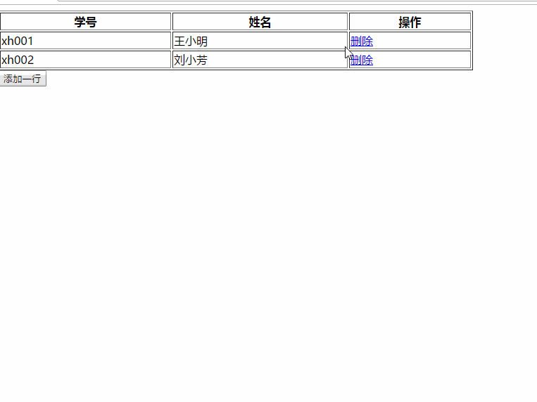

#动态添加/删除子元素

###用HTML写一个表格，之后利用js编写，实现行的删除，添加，鼠标移入和移出的格式变化。

1. 鼠标hover上去的改变元素的背景颜色，鼠标移开的时候再改变一下元素的背景色。

2. 增加一个添加行的函数，通过获取表格，之后动态的追加行，再在行中动态添加3列，注意在添加的a标签中要放置函数，onclick = deleteRow(this)

3. 删除函数，通过this选取到当前编辑的单元格，之后通过parentNode一级级向上查找到tr行元素，之后通过获取该行元素的index，通过.deleteRow(index)删除该行。

   

