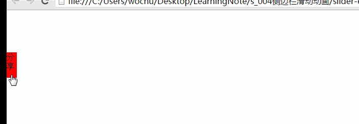

#sliderBar

1. 首先通过CSS样式将侧边栏隐藏，只露出分享按钮
2. 之后再通过标志位flag 设置0或者1 这两种状态，分别进行两个方向上的移动。
3. 使用Move()函数进行移动，可以规定speed也可以动态计算speed，本例中通过计算Target-box.offsetLeft的数值定义speed，这样就能保证开始速度快之后速度慢的效果。
4. 如果达到指定位置时，则停掉定时器，否则，将一直改变box.style.left的数值来控制运动。

匀速滑动（透明度变化）

变速滑动(无透明度变化)

