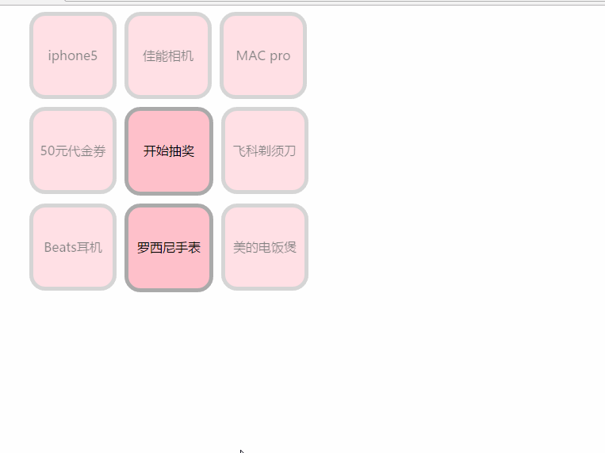

# Lottery draw

1. 获取中间的开始抽奖的LI元素，绑定函数Start(),之后每次抽奖的轮转的次数都是随机获得的。

2. 细节问题，当点击中间的LI元素的时候，此LI的内容由“开始抽奖”变成“Wait”，提醒用户等待。

3. 定义一个数组，里边写好数字，当遍历数组的时候，正好是抽奖循环顺序的LI的索引值。

4. 通过定时器循环一个loop函数，先将当前处于高亮的LI元素变成未抽中的状态，之后再通过

   i == 7 ? i = 0 : i++;进行判断，，如果等于7，就归零，如果不等于7，那么就i++，之后接着高亮下一个LI元素，之后随着循环次数times++，判断是否times==loop_times，如果相等那么就停止，清空定时器，接着变换中间LI元素的状态；如果不相等，就接着进行循环轮转。

5. 其中setTimeout(loop,20*times),实现了随着轮转次数的增加，轮转越来越慢的效果。

   

   ​