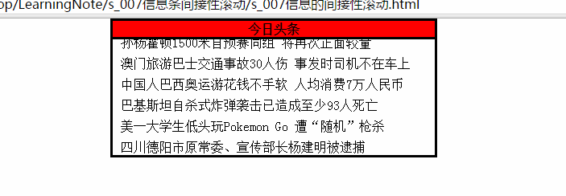

#Indirectly scrollTop

1. 实例演示了停顿滚动（间歇滚动），效果就是每2秒钟新闻向上滚动一行（滚动一行文字的距离）。为了达到循环滚动的效果，内容部分将文字复制了一份，当内容区域滚动了一半本身高度的时候，即Con.scrollTop >= Con.scrollHeight/2，那么则将内容区域的 Con.scrollTop = 0;，即回到原点，接着重复滚动。

2. 实际上是开了一个定时器timer和一个计时器setTimeout，定时器timer负责不断地去改变Con.scrollTop的数值，计时器则负责产生2S停顿效果。首先2S之后执行计时器，执行其中的语句Con.scrollTop++，之后就去执行回调函数scroll(),每50ms去执行一次，Con.scrollTop不断自加；当Con.scrollTop的值每次加到iLiheight的整倍数的时候，则清空一下定时器，之后过2S执行setTimeout，之后就是循环执行此过程了。

3. 注意最初的startMove()函数中的Con.scrollTop++;一定要有，否则就没办法启动滚动效果，因为Con.scrollTop将一直为0.

   

   ​