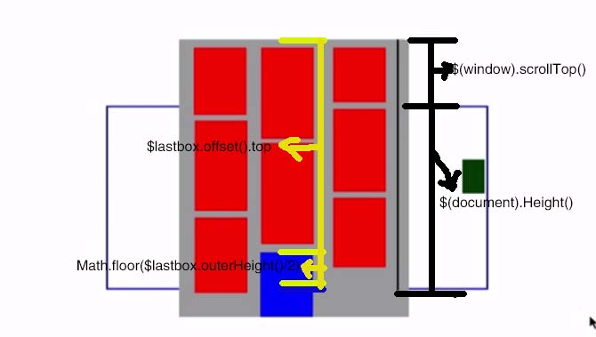

### waterfall###

1. **var minH = Math.min.apply(null,colH);**

   针对上述语句的解释:

   apply() 的作用是改变执行的执行环境。

   就是说数组 **colH** 没有min这个方法，但是**Math**对象可以求最小值，有min这个方法

   例如 var a = Math.min(3,2,1,4)，那么a将赋值为1

   **colH**想使用Math对象的min方法，就需要使用call/apply来改变执行环境了。

   Math.min(3,2,1,4)等价于 Math.min.apply(null, [3,2,1,4])，null是上下文，传入的对象对应函数中的this，min函数并没有使用this，因此这里可以为null，[3,2,1,4]是给min函数的参数列表。

2. 首先先执行一边waterfall()函数，将页面中已经存在的图片盒子排列一边，之后当页面滚动的时候检测一下check()函数的返回值，如果为true则继续加载图片，通过遍历dataimage.images中的图片，把每一张图片封装成一个图片盒子，之后执行一遍waterfall()函数排列一下，循环反复这个过程。

3. 其中waterfall()函数，根据 windowWidth/boxw，获取页面一共能够完整存放几列，之后要纪录每一列的高度，存放在数组picH中，就是遍历所有的图片盒子，获取每个盒子的高度，如果index小于列数cols，那么就直接存放在picH中，如果不是则要说明需要放置第二排了，这时候就需要获取picH中的最小值minH（即页面最短的那一列），通过最小数值minH找到其索引，之后可以对第二行的图片进行绝对定位，top:minH，left:minHIndex*boxw，最后记得更新一下minH,即picH[minHIndex]+=$boxs.eq(index).outerHeight();这样接下来的排列就会有新的高度数组picH作为依据，也许此时的minH已经不是最短的列。

4. check()函数用于检测是否到达加载的条件，即判断lastBoxDis < windowScroll+documentH)?true:false;是否为真，如果为真则加载。原理是检测最后一个图片盒子距离页面顶部的距离+自身高度的一半`$lastbox.offset().top + Math.floor($lastbox.outerHeight()/2)`，与页面此时离window窗口底部的距离`$(window).scrollTop()+$(document).height()`，两者作比较再做出判断，方法不唯一，这只是实现方法之一。

   ​

