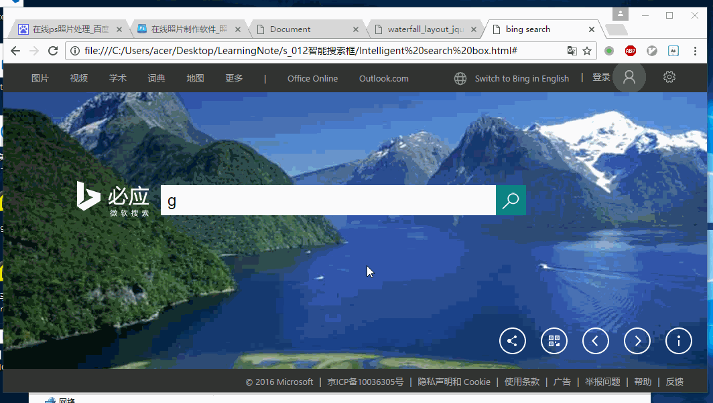

### bingSearch###
1. ##### 鼠标在hover导航栏上边的office Online的时候，出现下拉列表，其中鼠标直接移动到下拉列表的时候，下拉列表不消失，当鼠标移出下拉列表的时候，下拉列表消失，并且直接移出office Online也会消失。

   实现原理：其实跟布局有一定关系，这里的布局不太好，所以做起来有点麻烦，使用到了一个定时器timeout_id，作用是当鼠标离开#office-menu的时候，延迟100ms执行定时器，如果#office-list显示就隐藏它，但是正常情况下如果你真想操作#office-list的时候，耗费时间应该小于100ms,也就是说在100ms之前，timeout_id还没有触发之前，鼠标已经进去到#office-list元素里，这时候就清除timeout_id，则#office-list就不会隐藏了。

2. ##### 分享图标hover的时候，会出现微博，微信，QQ的图标，之后当鼠标短期内hover到这3个分享图标上的时候，那么这3个图标不会隐藏，之后离开之后则隐藏。

   实现原理和office Online 是如出一辙的，只不过为了显示向走拉出的效果，就不仅仅是对其hide()和show()做操作，而是改变#shareWay的宽度，隐藏则设置width:0,显示的话设置width:206

   此处有两个定时器，第一个定时器timer1是为了实现分享图标和#shareWay盒子之间的效果切换的问题；第二个定时器timer2是为了实现3个小图标之间进行切换时候出现的问题。

3. ##### 导航栏登录、设置和边栏部分

   逻辑比较简单，就是需要注意当点击登录按钮的时候，里边的登录盒子#login-box需要在点击的时候做toggle()操作，另外就是在点击它的时候，设置和边栏按钮需要隐藏，另外如果背景页面的透明度不是1，则要设置成1，设置按钮和边栏按钮也是一样的逻辑。

4. ##### 改变背景透明度

   当点击搜索框的时候，背景的透明度需要变成0.6，并且此时如果设置、登录和边栏处于内容露出状态，那么就需要隐藏这些内容，毕竟现在搜索是第一要务，点击页面其它地方的时候，透明度变成1.

5. ##### search搜索部分

   给搜索框.edit绑定一个keyup事件，当输入内容的时候触发这个事件，则显示搜索的结果框#search-result-list，当点击页面其它地方的时候就隐藏搜索的结果框#search-result-list，之后如果想做到像百度搜索那样的效果，就需要跨域请求，这里使用的JQuery的$.ajax方法，获取到输入的文本内容，并组成请求的url,之后传给querySUG()函数。

   在querySUG()函数中，就需要遍历返回的json对象的搜索内容部分，动态的添加子元素到搜索框#search-result-list中，之后呈现在我们眼前的就是这样的结果喽。

6. ##### 写HTML最重要的我想就是布局了，一个好的布局可以让你思维清晰，写css和js的时候都行云如水；但是如果你布局混乱，那真的是越到后边，越艰难，变一个参数，可能两三部分的布局都乱掉了，所以写HTML之前要先分析布局，一个区域的东西写在一起，这样比较好理解。

7. ##### 看书并不能将所有的知识记录下来，实现是检验真理的唯一标准，通过动手才知道自己哪些地方不会，哪些看过之后却有忘记了，或者是曾经认为不重要的知识点，也会重新认识其重要性。

8. ##### 对于ID，class取名要遵循语义话，不止自己能看懂，别人也能很轻松看懂。

9. ##### css中的选择器很重要，选择器的优先级也很重要，如果不注意，很可能会出现前边样式覆盖后边所写的样式的情况，所以还是需要注意的，最起码知道出现问题之后，问题出在哪里。

10. ##### CSS控制HTML页面效果有4种方式：行内方式、内嵌方式、链接方式、导入方式 ，优先级是 行内样式>内嵌样式>链接样式>导入样式。

11. ##### 当盒子有重叠的时候，注意使用z-index属性，有时候逻辑是对的，但是就是没显示出来，可能是覆盖在其上边的元素设置的z-index属性，那么下边的元素也要设置相应的z-index值

12. ##### mouseenter和mouseover的区别，mouseleave和mouseout的区别，在于子元素是否会触发事件。

