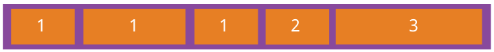

## CSS&CSS3知识点总结## 

### 一.CSS2知识点总结###

#### 1.脱离文档流分析####

  >**1.1 block、inline、inline-block** 
  >
  >  >常见的块级元素：div，p，table，form，ul，li，ol，dl，h1-h5，pre
  >  >
  >  >常见的行级元素：span，a，img，input，strong，em，lable，select，textarea
  >  >
  >  >**inline-block：**
  >  >
  >  >简单来说就是在CSS中通过display:inline-block对一个对象指定inline-block属性，可以将对象呈递为内联对象，但是对象的内容作为块对象呈递；简单来讲就是，设置了inline-block的元素既具有宽度高度特性，又具有同行特性 
  >  >
  >  >**block:**
  >  >
  >  >block元素通常被现实为独立的一块，**独占一行**，多个block元素会各自新起一行，默认 **block元素宽度自动填满其父元素宽度**。block元素可以设置width、height、margin、padding属性；
  >  >
  >  >**inline:**
  >  >
  >  >inline元素不会独占一行，多个相邻的行内元素会排列在同一行里，直到一行排列不下，才会新换一行，其宽度随元素的内容而变化。**inline元素设置width、height属性无效。** **inline元素的margin和padding属性**。水平方向的padding-left, padding-right, margin-left, margin-right都产生边距效果；但**竖直方向的padding-top, padding-bottom, margin-top, margin-bottom不会产生边距效果。**
  >
  >**1.2 文档流和脱离文档流**
  >
  >  >**所谓的文档流**，指的是元素排版布局过程中，元素会自动从左往右，从上往下的流式排列。
  >  >
  >  > **脱离文档流**，也就是将元素从普通的布局排版中拿走，其他盒子在定位的时候，会当做脱离文档流的元素不存在而进行定位。
  >
  >**1.3** **只有绝对定位absolute和浮动float才会脱离文档流。**
  >
  >  >需要注意的是，使用**float脱离文档流** 时，其他盒子会无视这个元素，但**其他盒子内的文本** 依然会为这个元素让出位置，环绕在周围(可以说是部分无视)。
  >  >
  >  >而对于使用**absolute position脱离文档流** 的元素，其他盒子与其他盒子内的文本都会无视它。(可以说是完全无视)
  >
  >**1.4 浮动和清除浮动** 
  >
  >  >**1.4.1** 浮动元素设置了浮动，只会对其后边的元素产生影响，但是对block元素和inline元素的影响不同
  >  >
  >  >> a.浮动的框之后的block元素元素会认为这个框不存在，但其中的文本依然会为这个元素让出位置。 
  >  >>
  >  >> b.浮动的框之后的inline元素，会为这个框空出位置，然后按顺序排列（大概是本身inline元素没有宽高属性，所以文本内容为浮动元素让出位置）
  >  >>
  >  >> 
  >  >
  >  >**1.4.2** 元素浮动造成的两个div覆盖或相互重叠如何解决？
  >  >
  >  >> **a. 左右结构div盒子重叠现象** 
  >  >>
  >  >> 解决方法：要么**都** 不使用浮动；要么**都使用** float浮动；要么对没有使用float，
  >  >>
  >  >>  **浮动的DIV设置margin样式** ，浮动元素后边的元素设置margin属性。
  >  >>
  >  >> **b. 上下结构div盒子重叠现象** 
  >  >>
  >  >> 解决方法：1、要么给.container设置固定高度，一般情况下文字内容不确定多少就不能设置固定高	度，所以一般不能设置“.container”高度。
  >  >>
  >  >> 2、要么清除浮动。			
  >
  >**1.5清除浮动的原理**
  >
  >  >clear语法：
  >  >
  >  >clear : none | left | right | both
  >  >
  >  >none : 默认值。允许两边都可以有浮动对象		
  >  >
  >  >left : 不允许左边有浮动对象		
  >  >
  >  >right : 不允许右边有浮动对象		
  >  >
  >  >both : 不允许有浮动对象
  >  >
  >  >**a)**但是需要注意的是：clear属性只会对自身起作用，而不会影响其他元素。如果一个元素的右侧有一浮	动对象，而这个元素设置了不允许右边有浮动对象，即clear：right，则这个元素会自动下移一格，达到本元素右边没有浮动对象的目的。
  >  >
  >  >**b)**clear:both,给浮动元素后边加上一个空白块，之后给这个块设置一个clear:both属性
  >  >
  >  >**c)**给浮动元素的父元素设置overflow：hidden来清除浮动。
  >
  >**1.6定位** 
  >
  >  >position:  static，relative，absolute，fix
  >  >
  >  >（1）static 默认值，无定位，不能当作绝对定位的参照物，并且设置标签对象的left、top等值是不起作用的。
  >  >
  >  >（2）relative 相对定位，
  >  >
  >  >相对定位是相对于该元素在文档流中的原始位置，即以自己原始位置为参照物，有趣的是，即使设	定了元素的相对定位以及偏移值，元素还占有着原来的位置，即占据文档流空间（相对定位后的元素则会叠加到新位置的上，覆盖原先新位置上的元素，但是在新位置上不实际占据空间）。	
  >  >
  >  >**relative的另一个主要用法：方便绝对定位元素找到参照物。** 
  >  >
  >  >（3）absolute 绝对定位
  >  >
  >  >**设置为绝对定位的元素框从文档流完全删除，并相对于最近的已定位祖先元素定位** ，元素定位后生成一个块级框，绝对定位是不占位置的，它会像PS的图层一样单独做一层，至于第几层你可以通过z-index:这个属性来设置。
  >  >
  >  >**重点：如果父级设置了position属性，例如position:relative;，那么子元素就会以父级的左上角为原始点进行定位。这样能很好的解决自适应网站的标签偏离问题，即父级为自适应的，那么子元素就设置position:absolute;父元素设置position:relative;，然后Top、Right、Bottom、Left用百分比宽度表示。**
  >  >
  >  >设置了绝对定位的元素，margin-bottom 和margin-right的值不再对文档流中的元素产生影响，因为该元素已经脱离了文档流。另外，不管它的祖先元素有没有定位，都是以文档流中原来所在的位置上偏移参照物。 
  >  >
  >  >（4）fix定位
  >  >
  >  >元素框的表现类似于将 position 设置为 absolute，不过其包含块是视窗本身。
  >  >
  >  >摘自：http://www.cnblogs.com/shenfangfang/p/5278528.html		

#### 2.在一个较小的屏幕上显示一个超大的图片的两种常用方法：####

> 2.1把图片设置成屏幕的背景
>
> 2.2使用background-size进行设置：background-size：cover（覆盖）,contain（内容）,length,percentage

#### 3.利用CSS进行元素的水平居中：####

> 3.1设置text-align:center（只对行级元素起作用），要对其父级元素进行设置

> 3.2进行绝对定位，之后设置left:50%，margin设置一个负值（只对有宽高的需要定位的元素起作用）

#### 4.利用CSS进行垂直居中：####

> 4.1 **line-height:设置为高度** ，（一般会对文字，图片起作用）适用于高度一定的父级元素情况

> 4.2 **vertical-align**（把元素放在父级元素的中部） ：middle（只对inline-block元素起作用），适用有固定宽高的父级元素情况
>
> 用法一：父级元素进行设置{display:table-cell;vertical-align: middle;}，行级子元素设置成inline或者是inline-block;形式
>
> 用法二：对齐行内相邻元素，在不设置父级元素高度的同时，甚至其中一个元vertical-align:middle
>
> 4.3同时设置垂直和水平居中
>
>   > **定位50%+margin负值**
>   >
>   > 父级元素相对定位，子元素进行绝对定位，之后设置top:50%，left:50%，margin-left,margin-top设置一个负值（子元素此时要有宽高）
>
>   >**flex弹性盒子**
>   >
>   > 给父级元素设置display:flex; align-items:center;justify-content:center;之后相应的子元素就会相对于父级元素进行垂直和水平居中定位了（IE10及其以上）
>
>   >**display:table-cell**
>   >
>   >可以定位行级元素的垂直和水平居中，给父级元素设置display:table-cell,text-align:center;vertical-align:middle;即可(IE7及以下不支持此特性)

#### 5.a链接(如果不遵循这个顺序，可能在不同浏览器会出现不起作用的bug)####

关于a链接的4个状态在设置的时候需要注意一定的顺序，一般有以下的规矩：	

- a:hover 必须跟在 a:link 和 a:visited后面
- a:active 必须跟在 a:hover后面
- a链接的四种顺序是，lvha

#### 6.列表的设置中list-style其实是简写属性，属性具体列表如下所示:####

- list-style-type：设置列表项标志的类型，即列表项前边的标识是原点还是方块，或者是图片
- list-style-position：设置列表中列表项标志的位置（标志在li的位置）
- list-style-image：将图象设置为列表项标志（注意background的简写顺序，不重复）

#### 7.table表格中每个单元格都有独立边框，要使边框重合，就使用属性：####

table{border-collapse:collapse;}//是表格的两个边框合并变成一个边框

#### 8.关于设置边框：####

可以使用简写设置border，也可以分别设置border-width，border-style，border-color

但是如果分开设置的时候，就**一定要先设置好border-style,** 其余设置才能起作用。

设置上右下左边框的时候，可以单独进行设置，例如：border-left-color,border-top-style等

#### 9.轮廓（outline）:####

轮廓（outline）是绘制于元素周围的一条线，**位于边框边缘的外围** ，可起到突出元素的作用。

CSS outline 属性规定元素轮廓的样式、颜色和宽度，和border是一样设置的，只是位置不同而已。

#### 10.关于外边距（margin）和填充（padding）####

  >**10.1** margin没有背景颜色，是完全透明的，Margin可以使用负值，可能的值：auto，length，%
  >
  >**10.2** padding：完全透明的，不可以使用负值，可能的值：length,%

#### 11.分组选择器####

是将CSS设置一样的提取出来，写在一起，选择器用逗号分开，这样可以精简代码。

#### 12.visibility和display的区别：####

> **12..1 visibility** 属性是隐藏元素但保持元素的浮动位置，而display实际上是设置元素的浮动特征。
>
> visibility属性用来确定元素是显示还是隐藏，这用visibility="visible|hidden"来表示，当visibility被设置	为"hidden"的时候，元素虽然被隐藏了，仍然占据它原来所在的位置，元素被隐藏之后，就不能再接收到其它事件了，不会再显示出来了。

> **12.2 display** 属性就有一点不同了，none为隐藏（元素消失），可恢复。

#### 13.外边距合并的问题:####

块级元素的垂直相邻外边距会合并，而行内元素实际上不占上下外边距。行内元素的的左右外边距不会合并。同样地，浮动元素的外边距也不会合并。允许指定负的外边距值，不过使用时要小心。

#### 14.CSS组合选择符：####

​ 在 CSS3 中包含了四种组合方式:

- 后代选取器(以**空格** 分隔)
- 子元素选择器(以**大于号** 分隔）
- 相邻兄弟选择器（以**加号** 分隔）
- 普通兄弟选择器（以**破折号** 分隔）

#### 15.伪类和伪元素（伪元素一般在html中添加新元素，伪类只是个伪类名）:####

> **15.1 CSS伪类** 是用来添加一些选择器的特殊效果的。
>
>   >例如a链接的4种样式就是使用伪类来定义的
>   >
>   >**15.1.1** 伪类经常用到的有：**:visited，:link，:active，:hover，:focus** 
>   >
>   >**15.1.2** 另外还有一些用于选择父级元素下子元素的伪类选择器：
>   >
>   >**:first-child，:last-child，:nth-child(n)，:nth-last-child(n)：** first-child/:last-child给指定选择器下边作为第一个（最后一个）子元素特定元素添加样式。
>   >
>   >**p > i:first-child** ：P元素下边，作为第一个子元素的I标签添加样式，如果不是第一个，则不加
>   >
>   >**:first-of-type，:last-of-type，:nth-of-type(n),:nth-last-of-type(n)** ：特定选择器下边第一个指定类型的子元素的所有元素
>   >
>   >**:only-child：**必须要求特定选择器下只有一个此类标签作为子元素（子元素唯一）
>   >
>   >**:only-of-type** ：要求特定选择器下只有一个此类型标签（子元素可以不唯一）就可以添加样式。
>   >
>   >**:checked，:disabled，:enabled** ：一些表单元素的伪类， 所有选中，所有禁用，所有启用
>
> **15.2伪元素(CSS3中要求伪元素写双重冒号，所以我们还是规范一些)** ：
>
>   >**::before，::after** 在指定元素后边或前边添加相应的伪元素
>   >
>   >**:first-line，:first-letter** ：针对指定元素的第一个字母和第一行添加样式
>   >
>   >特别注意：如果设置伪元素，那么一定要设置content:""，如果伪元素中用到边框，必须要在伪元素对应的CSS中添加border-style属性，否则边框不能正常显示。 	

#### 16.opacity属性（CSS3中）代表透明度，不同浏览器使用，注意兼容性:####

 ```
{
 		opacity:0.4;
  		filter:alpha(opacity=40); /*  IE8 及其更早版本 */
}
 ```

#### 17.选择器的优先级####

   **17.1. 通常我们可以将CSS的优先级由高到低分为六组：**

  >1. 无条件优先的属性只需要在属性后面使用 !important 。它会覆盖页面内任何位置定义的元素样式。当然，IE 6不支持这个属性，于是它也成为一种hack被很多人所熟知，真正使命被人淡忘。
  >2. 第二高位的优先属性是在html中给元素标签加style（行内样式）。由于该方法会造成CSS的难以管理，所以不推荐使用。
  >3. 第三级优先的属性是由一个或多个id选择器来定义的。 #id{margin:0;} 会覆盖 .classname{margin:3px;}。
  >4. 第四级的属性由一个或多个 类选择器、属性选择器、伪类选择器定义。如 .classname{margin:3px;} 会覆盖 div{margin:6px;}
  >5. 第五级由一个或多个 标签选择器定义。如 div{margin:6px;}  覆盖  *{margin:10px;} 。
  >6. 最低一级的选择器是为一个通配选择器，用*{margin:10px;}这样的类型来定义。

**17.2css优先级规则简单方法**

  >比较简单易记的一种方法就是给不同选择器分配不同的值： 
  >1.id选择器默认优先级最高，其权值为100 
  >2.class选择器、属性选择器和伪类选择器的权值为10 
  >3.标签选择器的优先级较低，其权值为1 
  >所以在比较样式的优先级时，只需统计选择符中的id、class、标签名个数，然后把对应的权值相加即可。根据结果便可得出优先级高低。
  >
  >
  >1.结果较大的优先级较高 
  >2.结果相同，则后定义的样式优先级较高 
  >3.如果样式值中含有!important，则该值优先级最高 

#### 18.属性选择器：（根据元素的属性和属性值来定义元素的样式）:####


#### 19.flex弹性盒子布局####

**19.1任何一个容器都可以指定为Flex布局，无论块级元素还是行级元素**

```
.box{
  display: flex;
}
.box{
  display: inline-flex;
}
```

另外针对Webkit要加上hack

```
.box{
  display: -webkit-flex; /* Safari */
  display: flex;
}
```

**19.2Flex的浏览器支持情况**


**19.3使用了flex布局之后，子元素的`float`、`clear`和`vertical-align`属性将失效。**

**19.4flex布局容器的6个属性**

  >**flex-direction**
  >
  >  >此属性决定主轴的方向（即项目的排列方向）
  >  >
  >  >属性值有以下4个
  >  >
  >  >```
  >  >.box {
  >  >  flex-direction: row | row-reverse | column | column-reverse;
  >  >}
  >  >```
  >  >
  >  >其中
  >  >
  >  >- `row`（默认值）：主轴为水平方向，起点在左端。
  >  >- `row-reverse`：主轴为水平方向，起点在右端。
  >  >- `column`：主轴为垂直方向，起点在上沿。
  >  >- `column-reverse`：主轴为垂直方向，起点在下沿。
  >
  >**flex-wrap**
  >
  >  >默认情况下，项目都排在一条线（又称"轴线"）上。`flex-wrap`属性定义，如果一条轴线排不下，如何换行。
  >  >
  >  >属性值有3个
  >  >
  >  >```
  >  >.box{
  >  >  flex-wrap: nowrap | wrap | wrap-reverse;
  >  >}
  >  >```
  >  >
  >  >其中
  >  >
  >  >（1）`nowrap`（默认）：不换行。
  >  >
  >  >（2）`wrap`：换行，第一行在上方。
  >  >
  >  >（3）`wrap-reverse`：换行，第一行在下方。
  >
  >**flex-flow**
  >
  >> `flex-flow`属性是`flex-direction`属性和`flex-wrap`属性的简写形式，默认值为`row nowrap`。
  >>
  >> ```
  >> .box {
  >>   flex-flow: <flex-direction> || <flex-wrap>;
  >> }
  >> ```
  >
  >**justify-content**
  >
  >  >`justify-content`属性定义了项目在主轴(水平轴)上的对齐方式。
  >  >
  >  >可能的属性值有5个：
  >  >
  >  >- `flex-start`（默认值）：左对齐
  >  >- `flex-end`：右对齐
  >  >- `center`： 居中
  >  >- `space-between`：两端对齐，项目之间的间隔都相等。
  >  >- `space-around`：每个项目两侧的间隔相等。所以，项目之间的间隔比项目与边框的间隔大一倍。
  >
  >**align-items**
  >
  >  >`align-items`属性定义项目在交叉轴上如何对齐。
  >  >
  >  >它可能取5个值。具体的对齐方式与交叉轴的方向有关，下面假设交叉轴从上到下。
  >  >
  >  >> - `flex-start`：交叉轴的起点对齐。
  >  >> - `flex-end`：交叉轴的终点对齐。
  >  >> - `center`：交叉轴的中点对齐。
  >  >> - `baseline`: 项目的第一行文字的基线对齐。
  >  >> - `stretch`（默认值）：如果项目未设置高度或设为auto，将占满整个容器的高度。
  >
  >**align-content**
  >
  >  >`align-content`属性定义了多根轴线的对齐方式。如果项目只有一根轴线，该属性不起作用。
  >  >
  >  >```
  >  >.box {
  >  >  align-content: flex-start | flex-end | center | space-between | space-around | stretch;
  >  >}
  >  >```
  >  >
  >  >该属性可能取6个值。
  >  >
  >  >  >- `flex-start`：与交叉轴的起点对齐。
  >  >  >- `flex-end`：与交叉轴的终点对齐。
  >  >  >- `center`：与交叉轴的中点对齐。
  >  >  >- `space-between`：与交叉轴两端对齐，轴线之间的间隔平均分布。
  >  >  >- `space-around`：每根轴线两侧的间隔都相等。所以，轴线之间的间隔比轴线与边框的间隔大一倍。
  >  >  >- `stretch`（默认值）：轴线占满整个交叉轴。   

**19.5flex布局容器中项目的6个属性**

除了应用于容器上的6个属性，还有6个属性是应用于里边项目上的。

  >**order属性**
  >
  >  >`order`属性定义项目的排列顺序。数值越小，排列越靠前，默认为0。
  >  >
  >  >```
  >  >.item {
  >  >  order: <integer>;
  >  >}
  >  >```
  >  >
  >  >
  >
  >**flex-grow属性**
  >
  >  >`flex-grow`属性定义项目的放大比例，默认为`0`，即如果存在剩余空间，也不放大。
  >  >
  >  >```
  >  >.item {
  >  >  flex-grow: <number>; /* default 0 */
  >  >}
  >  >```
  >  >
  >  >
  >  >
  >  >如果所有项目的`flex-grow`属性都为1，则它们将等分剩余空间（如果有的话）。如果一个项目的`flex-grow`属性为2，其他项目都为1，则前者占据的剩余空间将比其他项多一倍。
  >
  >**flex-shrink属性**
  >
  >`flex-shrink`属性定义了项目的缩小比例，默认为1，即如果空间不足，该项目将缩小。
  >
  >```
  >.item {
  >  flex-shrink: <number>; /* default 1 */
  >}
  >```
  >
  >如果所有项目的`flex-shrink`属性都为1，当空间不足时，都将等比例缩小。如果一个项目的`flex-shrink`属性为0，其他项目都为1，则空间不足时，前者不缩小，属性为零相当于是最大的
  >
  >**4.4 flex-basis属性**
  >
  >  >`flex-basis`属性定义了在分配多余空间之前，项目占据的主轴空间（main size）。浏览器根据这个属性，计算主轴是否有多余空间。它的默认值为`auto`，即项目的本来大小。
  >  >
  >  >```
  >  >.item {
  >  >  flex-basis: <length> | auto; /* default auto */
  >  >}
  >  >```
  >
  >**4.5 flex属性**
  >
  >`flex`属性是`flex-grow`, `flex-shrink` 和 `flex-basis`的简写，默认值为`0 1 auto`。后两个属性可选。
  >
  >```
  >.item {
  >  flex: none | [ <'flex-grow'> <'flex-shrink'>? || <'flex-basis'> ]
  >}
  >```
  >
  >该属性有两个快捷值：`auto` (`1 1 auto`) 和 none (`0 0 auto`)。
  >
  >建议优先使用这个属性，而不是单独写三个分离的属性，因为浏览器会推算相关值。
  >
  >**align-self属性**
  >
  >`align-self`属性允许单个项目有与其他项目不一样的对齐方式，可覆盖`align-items`属性。默认值为`auto`，表示继承父元素的`align-items`属性，如果没有父元素，则等同于`stretch`
  >
  >```
  >.item {
  >  align-self: auto | flex-start | flex-end | center | baseline | stretch;
  >}
  >```

#### 20.各大浏览器的内核####

IE浏览器内核：Trident内核；Firefox浏览器内核：Gecko；Ssfari，Google浏览器内核：WebKit；

Opera 浏览器内核：Presto

#### 21.margin重叠####

margin重叠不会发生在水平方向上，只存在于垂直方向上。

分为两种情况：兄弟元素块之间的margin重叠，父子级块中的margin重叠，两者都是以较大的一个margin为作为块之间的间距的，如果出现负值，正值>|负值|，间距那么就让正值-|负值|，如果正值<|负值|，重叠的距离就会是|负值|-正值，如果都是负值，那么两个元素会重叠较大的那个|负值|那样的距离。

解决兄弟之间元素margin重叠的方法是：设置浮动（当然跟随着也有清除浮动的操作），设置inline-block，只要设置其中一个就行，当然这样块级元素就变成了行级元素，可能会涉及到设置宽高之类的。

解决父子元素之间重叠的方法是：设置父元素的overflow：hidden，

给父元素添加padding，给父元素添加border，如果只针对上边或者下边进行设置padding／border，那么没设置的一边还是会存在问题，子元素对应边的margin会消失。

另外或者给子元素设置position:absolute，进行绝对定位。


### 二.CSS3的一些新特性### 

#### 1.CSS3背景 background####

background 简写属性在一个声明中设置所有的背景属性。

可以设置如下属性：

- background-color：规定要使用的背景颜色。

- background-position：规定背景图像的位置。可能的值有百分比，以及方位词（top left，center center）

- background-size：规定背景图片的尺寸。可能的值有cover,contain,percentage,length

- background-repeat：规定如何重复背景图像。可能的值有repeat,no-repeat,repeat-x,repeat-y,inherit

- background-origin：规定背景图片的定位区域。可能的值有border-box，padding-box，content-box

- background-clip：规定背景的绘制区域。可能的值有border-box，padding-box，content-box

- background-attachment：规定背景图像是否固定或者随着页面的其余部分滚动。

- background-image：规定要使用的背景图像。可以是多个图像一起使用

  案例：

  ```
  <!DOCTYPE html>
  <html lang="en">
  <head>
  <meta charset="UTF-8">
  <title>裁剪图片</title>
  <style>	
  html,body{
  	margin: 0;
  	padding: 0;
  	background: gray;
  }
  #backround{
  	height: 160px;
  	width: 160px;
  	padding: 70px;
  	margin: 100px auto;
  	position: relative;
  	box-sizing: content-box;
  	border: 2px dashed yellow;
  	background: url(autumn.jpg) no-repeat;
  }
  div::before,div::after{
  	content: "";
  	top: 0;
  	height: 160px;
  	width: 160px;
  	padding: 70px;
  	background: url(autumn.jpg) no-repeat;
  	background-clip: content-box;
  	background-clip: content-box;
  	position: absolute;
  }
  div::before{	
  	right: 0;
  	background: white;
  	background-clip: content-box;
  }
  div::after{	
  	left: 50px;
  	top: 50px;
  }
  </style>
  </head>
  <body>
  <div id="backround"></div>	
  </body>
  </html>
  ```

  效果：

   

  2.边框圆角


#### 2.边框图片#### 

**border-image：** 允许你指定一个图片作为边框

语法：border-image: *source slice width outset repeat*;

source:指的是边框图片的资源，也就是用来作为边框的图片

slice（不加单位）:边框图像的顶部，右侧，底部，左侧的内偏移量，

 width:图片边框的宽度（实际取决于设置的边框的宽度）

outset:边框图像区域超出边框的量。

 repeat:图像边框是否应平铺(repeated)、铺满(rounded)或拉伸(stretched)。

#### 3.边框圆角####

border-radius：让边框产生圆角,如果只有一个数值的时候，那么会在四个角产生圆角，如果是想要在某个角不产生圆角，那么可以不在那个角设置数值

 方位写法:border-top-left-radius,左上

 ​		border-top-right-radius,右上

 ​		border-bottom-right-radius,右下

 		border-bottom-left-radius，左下 

 #### 4.盒阴影#### 

 box-shadow：box-shadow: *h-shadow v-shadow blur spread color* inset;

  分别代表水平阴影，垂直阴影，模糊度，阴影的大小，颜色，从外层的阴影（开始时）改变阴影内侧阴影

#### 5.box-sizing属性####

对于浏览器有兼容性问题，box-sizing:border-box;-moz-box-sizing:border-box; /* Firefox */-webkit-box-sizing:border-box;解决兼容性问题；

> 其属性值有content-box，border-box，inherit
>
> **1）** content-box：设置的宽高不包含边框和内边距
>
> **2）** border-box：设置的宽高包含内边距和边框，如果算真是的宽度和高度的话，要减去这两者
>
> **3）**inherit，规定应从父元素继承 box-sizing 属性的值。

 #### 6.CSS3渐变#### 

 **6.1** CSS3定义了两种类型的渐变

  >- **线性渐变（Linear Gradients）- 向下/向上/向左/向右/对角方向（默认是上到下，左到右）**
  >
  >  线性渐变的方向有多种写法，用的时候可以搜索一下，或者是翻看别的总结。
  >
  >  background: linear-gradient(*direction*, *color-stop1*, *color-stop2, ...*)；
  >
  >- **径向渐变（Radial Gradients）- 由它们的中心定义**
  >
  >  ```
  >  background: radial-gradient(*center, shape size, start-color, ..., last-color*);
  >  ```
  >
  >  径向渐变的定位原点可以自己设置，另外形状可以自己设置，一般是圆形和椭圆

 **6.2线性渐变和径向渐变都可以进行重复：** 

  >```
  >background: repeating-radial-gradient(red, yellow 10%, green 15%);                                                                                                                   background: repeating-linear-gradient(red, yellow 10%, green 20%);  
  >```

 #### 7.文本效果：####

 CSS3文本效果：text-shadow，box-shadow，text-overflow，word-wrap，word-break

 **7.1** text-shadow，box-shadow：分别指定了水平阴影，垂直阴影，模糊距离，颜色

**7.2**Text Overflow：指定溢出的文字如何显示clip（截取掉），ellipsis（省略号）

**设置文字出现省略号的前提是：white-space:nowrap; overflow:hidden; 文字不卷曲，溢出隐藏** 

**7.3** 文本的换行，如果单词太长，那么word-wrap:break-word;可以把长单词打断，换行

 **7.4** word-break: keep-all;在不打断单词的情况下换行，word-break: break-all;可以打断文字

#### 8.CSS3自定义字体####

@font-face 规则：使用CSS3我们可以使用自己设计的字体（在其他网站上生成）

 我们自己的字体是使用@font-face 规则进行定义的，**使用之前必须定义名称，还要指向相应的字体文件** 

```
@font-face{
 		font-family: myFirstFont;
 		src: url(sansation_light.woff);//在指定文件类型的时候，可以多指定一些类型，方便浏览器识别
}
```

 #### 9.CSS3转换（transform）####

**我们可以移动，比例化，反过来，旋转，和拉伸元素。**

- translate()：根据左(X轴)和顶部(Y轴)位置给定的参数，从当前元素位置移动。
- rotate()：在一个给定度数顺时针旋转的元素。负值是允许的，这样是元素逆时针旋转。
- scale()：scale()方法，该元素增加或减少的大小，取决于宽度（X轴）和高度（Y轴）的参数：
- skew()：分别表示X轴和Y轴倾斜的角度
- matrix()：有六个参数，包含旋转，缩放，移动（平移）和倾斜功能。

**3D转化，translateX(*x*)，scaleY(*y*)，rotateZ(*angle*)等等，分为3个方向进行变化，X,Y,Z**  

 #### 10.过渡（transition）####

**10.1** 过渡是从一种效果变换到另外一种效果，要实现这一点必须规定两项内容：	

- 指定要添加效果的CSS属性
- 指定效果的持续时间。

   **10.2**过渡有4个属性值：transition-delay，transition-duration，

transition-property，transition-timing-function

 #### 11.动画 ####

**语法：@keyframes myfirst{动画效果}** ，动画效果可以使用from to选择器,也可以使用各个百分比选择器，**动画必须绑定到某个选择器，并且规定名称和时长，才能有效果。** 

    @keyframes myfirst{
         from {background: red;}
         to {background: yellow;}
     }
    div{
         animation: myfirst 5s;
         -webkit-animation: myfirst 5s; /* Safari 与 Chrome */
     }
 #### 12.多列布局####

多列布局可以将文本内容设计的像报纸那样的排版

#### 13 . CSS3有很多图片滤镜可以使用，可以制作出模糊，变亮等等各种效果####

#### 14.button标签的设置:####

button标签可以使用background-color来设置背景色，可以使用font-size来设置大小，

使用border-radius来设置圆角，也可以用CSS3各种效果做出各种按钮。

#### 15.弹性盒子用到的时候自己查文档，内容比较多####

#### 16.多媒体查询####

语法：`@media not|only mediatype and (查询条件) {CSS 代码...;（指定样式）}`													


媒体查询由多种媒体组成，可以包含一个或多个表达式，表达式根据条件是否成立返回 true 或 false。如果结果返回true，那么则会显示指定的样式，否则不显示

除非你使用not 或 only 操作符，否则所有的样式会适应在所有设备上显示效果，此处all是经常用到的。

#### 17.position定位的新属性值：sticky####

**17.1** sticky属性值不是W3C标准推荐的用法，主要应用在移动端，另外PC和ios的safari中也兼容此属性。用于解决因scroll监听引起的问题。

**17.2** scroll监听问题：

- 在浏览器端和安卓设备上，scroll事件连续触发，如果在监听函数中做过于复杂的判断，肯定会暂时阻塞ui（主）线程的渲染，造成卡顿
- 在ios设备中，scroll事件在上下滑动的过程中js不会连续执行，只在滑动结束的时刻执行一次，并且不支持左右滑动事件的触发

**17.3** scroll监听问题解决办法：

- 针对scroll做throttle节流（窗口变化resize，滚动scroll等等），避免每次滑动都执行，可以设置时间间隔，如50ms
- 在监听函数中计算元素的layout属性，可用setTimeout在定时器队列尾插入任务，异步渲染
- ios设备实现了一个属性－position：sticky，可以不用js来完成粘性布局

  **17.4** sticky属性使用条件：	

+ 元素并不会脱离文档流，当元素被粘在视口的顶部时，原来在文档流中的位置仍然占据着（在屏幕范围（viewport）内时该元素的位置并不受到定位影响（设置top、left等属性无效），当该元素的位置将要移出偏移范围时，定位又会变成fixed，根据设置的left、top等属性成固定位置的效果。）

+ 元素相对于其最近可滚动的祖先元素“粘性定位”，如果其祖先元素都不能滚动，则相对于适口定位

+ 元素最近的祖先元素overflow设置为非默认值visible时，则元素相对于该祖先元素进行sticky定位。若最近的祖先元素设置为overflow:hidden，则元素不会sticky定位。


#### 18.渐进增强和优雅降级####

渐进增强：一开始就针对低版本浏览器进行构建页面，完成基本的功能，然后再针对高级浏览器进行效果、交互、追加功能达到更好的体验。（向上兼容）

优雅降级：一开始就构建站点的完整功能，然后针对浏览器测试和修复。比如一开始使用 CSS3 的特性构建了一个应用，然后逐步针对各大浏览器进行 hack 使其可以在低版本浏览器上正常浏览。（向下兼容）


