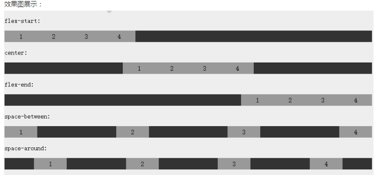

#伸缩布局 

1. RGBA,HSLA,透明度设置不具有继承性，不会影响子元素

2. 伸缩布局

   弹性盒子由弹性容器(Flex container)和弹性子元素(Flex item)组成。

   弹性容器通过设置 display 属性的值为 flex 或 inline-flex将其定义为弹性容器。

   弹性容器内包含了一个或多个弹性子元素。

   **1） flex-direction属性**

   语法：flex-direction: row | row-reverse | column | column-reverse

   **2）justify-content 属性** 

   内容对齐（justify-content）属性应用在**弹性容器** 上，把弹性项沿着弹性容器的主轴线（main axis）对齐。

   语法：justify-content: flex-start | flex-end | center | space-between | space-around

   - **flex-start：**
     弹性项目向行头紧挨着填充。这个是默认值。第一个弹性项的main-start外边距边线被放置在该行的main-start边线，而后续弹性项依次平齐摆放。

   - **flex-end：**
     弹性项目向行尾紧挨着填充。第一个弹性项的main-end外边距边线被放置在该行的main-end边线，而后续弹性项依次平齐摆放。

   - **center：**
     弹性项目居中紧挨着填充。（如果剩余的自由空间是负的，则弹性项目将在两个方向上同时溢出）。

   - **space-between：**
     弹性项目平均分布在该行上。如果剩余空间为负或者只有一个弹性项，则该值等同于flex-start。否则，第1个弹性项的外边距和行的main-start边线对齐，而最后1个弹性项的外边距和行的main-end边线对齐，然后剩余的弹性项分布在该行上，相邻项目的间隔相等。

   - **space-around：**
     弹性项目平均分布在该行上，两边留有一半的间隔空间。如果剩余空间为负或者只有一个弹性项，则该值等同于center。否则，弹性项目沿该行分布，且彼此间隔相等（比如是20px），同时首尾两边和弹性容器之间留有一半的间隔（1/2*20px=10px）。

     

   **3）align-items 属性** 

    align-items 设置或检索弹性盒子元素在侧轴（纵轴）方向上的对齐方式。

   语法：align-items: flex-start | flex-end | center | baseline | stretch

   - flex-start：弹性盒子元素的侧轴（纵轴）起始位置的边界紧靠住该行的侧轴起始边界。
   - flex-end：弹性盒子元素的侧轴（纵轴）起始位置的边界紧靠住该行的侧轴结束边界。
   - center：弹性盒子元素在该行的侧轴（纵轴）上居中放置。（如果该行的尺寸小于弹性盒子元素的尺寸，则会向两个方向溢出相同的长度）。
   - baseline：如弹性盒子元素的行内轴与侧轴为同一条，则该值与'flex-start'等效。其它情况下，该值将参与基线对齐。
   - stretch：如果指定侧轴大小的属性值为'auto'，则其值会使项目的边距盒的尺寸尽可能接近所在行的尺寸，但同时会遵照'min/max-width/height'属性的限制。

   **4）flex-wrap 属性**

   **flex-wrap** 属性用于指定弹性盒子的子元素换行方式。

   语法：flex-wrap: nowrap||wrap||wrap-reverse;

   - **nowrap** - 默认， 弹性容器为单行。该情况下弹性子项可能会溢出容器。
   - **wrap** - 弹性容器为多行。该情况下弹性子项溢出的部分会被放置到新行，子项内部会发生断行
   - **wrap-reverse** -反转 wrap 排列。

   **5）align-content 属性**

   align-content属性用于修改 flex-wrap 属性的行为。类似于 align-items, 但它不是设置弹性子元素的对齐，而是设置各个行的对齐。

   语法：align-content: flex-start | flex-end | center | space-between | space-around | stretch

   - `stretch` - 默认。各行将会伸展以占用剩余的空间。
   - `flex-start` - 各行向弹性盒容器的起始位置堆叠。
   - `flex-end` - 各行向弹性盒容器的结束位置堆叠。
   - `center` -各行向弹性盒容器的中间位置堆叠。
   - `space-between` -各行在弹性盒容器中平均分布。
   - `space-around` - 各行在弹性盒容器中平均分布，两端保留子元素与子元素之间间距大小的一半。

   **6）弹性子元素属性**

   排序(order)，对齐()

   第一个弹性子元素上设置了 `margin-right: auto;` 。 它将剩余的空间放置在元素的右侧：

   完美的居中：margin: auto;可以使得弹性子元素在两上轴方向上完全居中

   **flex** ：flex属性用于指定弹性子元素如何分配空间。（父级盒子剩余的空间）

   语法：flex：none | [ flex-grow ] || [ flex-shrink ] || [ flex-basis ]

   - none：none关键字的计算值为: 0 0 auto
   - [ flex-grow ]：定义弹性盒子元素的扩展比率。
   - [ flex-shrink ]：定义弹性盒子元素的收缩比率。
   - [ flex-basis ]：定义弹性盒子元素的默认基准值。

   **align-self** ：align-self属性用于设置弹性元素自身在侧轴（纵轴）方向上的对齐方式。

   语法：align-self: auto | flex-start | flex-end | center | baseline | stretch

   - auto：如果'align-self'的值为'auto'，则其计算值为元素的父元素的'align-items'值，如果其没有父元素，则计算值为'stretch'。

   - flex-start：弹性盒子元素的侧轴（纵轴）起始位置的边界紧靠住该行的侧轴起始边界。

   - flex-end：弹性盒子元素的侧轴（纵轴）起始位置的边界紧靠住该行的侧轴结束边界。

   - center：弹性盒子元素在该行的侧轴（纵轴）上居中放置。（如果该行的尺寸小于弹性盒子元素的尺寸，则会向两个方向溢出相同的长度）。

   - baseline：如弹性盒子元素的行内轴与侧轴为同一条，则该值与'flex-start'等效。其它情况下，该值将参与基线对齐。

   - stretch：如果指定侧轴大小的属性值为'auto'，则其值会使项目的边距盒的尺寸尽可能接近所在行的尺寸，但同时会遵照'min/max-width/height'属性的限制。

   ​

   ​

   ​

