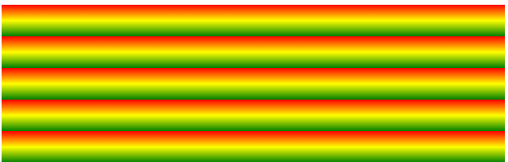
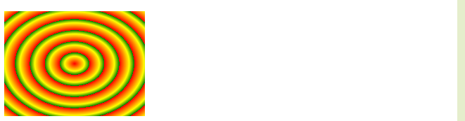

#渐变

CSS3 渐变（gradients）可以让你在两个或多个指定的颜色之间显示平稳的过渡。

CSS3 定义了两种类型的渐变（gradients）：

- **线性渐变（Linear Gradients）- 向下/向上/向左/向右/对角方向**
- **径向渐变（Radial Gradients）- 由它们的中心定义**

**1）线性渐变语法：** 

- background: linear-gradient(*direction*, *color-stop1*, *color-stop2, ...*)；

其中方向这一块有很多表示方式，省略的情况下，默认是从上向下的渐变，其余可以指定 left，to left，left top，to left top，角度等等

- 如果是颜色有多个结点的情况下，可以使用颜色后边带上百分比的方式进行设置

eg：linear-gradient(red, yellow 10%, green 20%)，其中百分比代表颜色出现的位置，如果是以下的情况，那么后边较小的颜色值将不起作用

eg：linear-gradient(red, yellow 50%, green 40%)

**2）渐变可以重复，线性渐变和径向渐变都可以重复** 　 

​	重复的线性渐变：
    background: -webkit-repeating-linear-gradient(red, yellow 10%, green 20%); /* Safari 5.1 - 6.0 */
    background: -o-repeating-linear-gradient(red, yellow 10%, green 20%); /* Opera 11.1 - 12.0 */
    background: -moz-repeating-linear-gradient(red, yellow 10%, green 20%); /* Firefox 3.6 - 15 */
    background: repeating-linear-gradient(red, yellow 10%, green 20%); /* 标准的语法（必须放在最后） */
出现的是重复的效果：

径向渐变重复的结果：

标准写法可以是：

background: repeating-radial-gradient(red, yellow 10%, green 15%);                                                                                                                                                                                                                                                                                                                                                                                                                                                                                                                                 background: repeating-linear-gradient(red, yellow 10%, green 20%);  

**3）径向渐变语法：**

background: radial-gradient(*center, shape size, start-color, ..., last-color*);

或者是标注辐射范围（分为两个方向，以及与圆心点 ）其中center可以用数值表示

- 为了创建一个径向渐变，你也必须至少定义两种颜色结点。颜色结点即你想要呈现平稳过渡的颜色。同时，你也可以指定渐变的中心、形状（原型或椭圆形）、大小。默认情况下，渐变的中心是 center（表示在中心点），渐变的形状是 ellipse（表示椭圆形），渐变的大小是 farthest-corner（表示到最远的角落）。
- 颜色结点**均匀分布**的径向渐变：background: radial-gradient(red, green, blue); /* 标准的语法 */*
- 颜色结点**不均匀分布**的径向渐变：background: radial-gradient(red 5%, green 15%, blue 60%); /* 标准的语法 */

**设置形状：** 

shape 参数定义了形状。它可以是值 circle 或 ellipse。其中，circle 表示圆形，ellipse 表示椭圆形。默认值是 ellipse。

设置圆形渐变

background: radial-gradient(circle, red, yellow, green); /* 标准的语法 */

**不同尺寸大小关键字的使用** 

size 参数定义了渐变的大小。它可以是以下四个值：

- closest-side
- farthest-side
- closest-corner
- farthest-corner