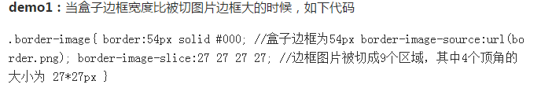
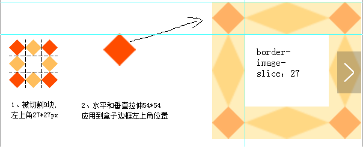
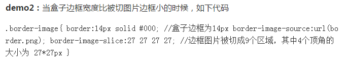
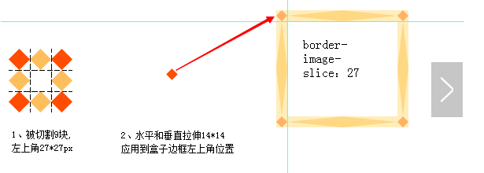
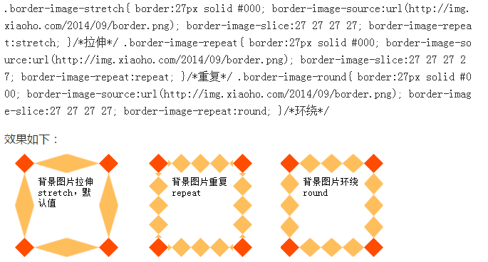

# 边框图片  border-image#

1. **border-image**  有几大属性，分别是border-image-source，border-image-slice，border-image-width，图片外凸border-image-outset，图片重复border-image-repeat（stretch  repeat  round）

2. border-image-slice指定边框图像顶部、右侧、底部、左侧内偏移量。其中特别要说明的是其与border-image-width的关系

   如果设置边框图片的宽度和切片，那么先对图片进行切片处理，之后再对四周的宽度进行变化。有图为例

     

   ​    

   ​      

    

3. **border-image-outset** 作用)

4. **border-image-repeat** 指定边框背景是否重复，分为可分别对上下左右进行不同设置

   stretch代表不重复，只是水平和数值方向的拉伸，填满空隙

   repeat代表分别在水平和数值方向上进行重复，把边框填满，对称的

   round代表是在整个边框空隙中进行重复，小部件不多不少，正好合适，可能会改变图小部件的尺寸

    

5. 一般是设置边框图片的时候一定要设置边框的宽度，否则显示出来不是想要的效果。

   eg:

   ```css
   div{
   	border:15px solid transparent;
   	width:300px;
   	padding:10px 20px;
   }

   div{
   	-moz-border-image:url(/i/border.png) 30 30 round;	/* Old Firefox */
   	-webkit-border-image:url(/i/border.png) 30 30 round;	/* Safari and Chrome */
   	-o-border-image:url(/i/border.png) 30 30 round;		/* Opera */
   	border-image:url(/i/border.png) 30 30 round;
   }
   ```

