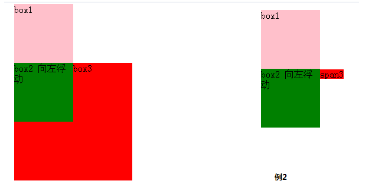

1. **CSS3背景 background** 

   background 简写属性在一个声明中设置所有的背景属性。

   可以设置如下属性：

   - background-color：规定要使用的背景颜色。

   - background-position：规定背景图像的位置。

   - background-size：规定背景图片的尺寸。

   - background-repeat：规定如何重复背景图像。

   - background-origin：规定背景图片的定位区域。

   - background-clip：规定背景的绘制区域。

   - background-attachment：规定背景图像是否固定或者随着页面的其余部分滚动。

   - background-image：规定要使用的背景图像。

     案例：

     	<!DOCTYPE html>
     	<html lang="en">
     	<head>
     	<meta charset="UTF-8">
     	<title>裁剪图片</title>
     	
     	</head>
     	<body>
     	

	
     	</body>
     	</html>
     效果：

      

     ​

2. box-sizing属性

   对于浏览器有兼容性问题，box-sizing:border-box;-moz-box-sizing:border-box; /* Firefox */-webkit-box-sizing:border-box;解决兼容性问题；

   其属性值有content-box，border-box，inherit

   **1）** content-box：设置的宽高不包含边框和内边距

   **2）** border-box：设置的宽高包含内边距和边框，如果算真是的宽度和高度的话，要减去这两者

   **3）**inherit，规定应从父元素继承 box-sizing 属性的值。

3. 脱离文档流分析

   **3.1 block、inline、inline-block** 

   常见的块级元素：div，p，table，form，ul，li，ol，dl，h1-h5，pre

   常见的行级元素：span，a，img，input，strong，em，lable，select，textarea

   **inline-block：**

   简单来说就是在CSS中通过display:inline-block对一个对象指定inline-block属性，可以将对象呈递为内联对象，但是对象的内容作为块对象呈递；简单来讲就是，设置了inline-block的元素既具有宽度高度特性，又具有同行特性 

   **block:**

   block元素通常被现实为独立的一块，**独占一行**，多个block元素会各自新起一行，默认 **block元素宽度自动填满其父元素宽度**。block元素可以设置width、height、margin、padding属性；

   **inline:**

   inline元素不会独占一行，多个相邻的行内元素会排列在同一行里，直到一行排列不下，才会新换一行，其宽度随元素的内容而变化。**inline元素设置width、height属性无效。** **inline元素的margin和padding属性**。水平方向的padding-left, padding-right, margin-left, margin-right都产生边距效果；但**竖直方向的padding-top, padding-bottom, margin-top, margin-bottom不会产生边距效果。**

   ​

   **3.2** 文档流和脱离文档流

   **所谓的文档流**，指的是元素排版布局过程中，元素会自动从左往右，从上往下的流式排列。

    **脱离文档流**，也就是将元素从普通的布局排版中拿走，其他盒子在定位的时候，会当做脱离文档流的元素不存在而进行定位。

   ​

   **3.3** **只有绝对定位absolute和浮动float才会脱离文档流。**

   需要注意的是，使用**float脱离文档流** 时，其他盒子会无视这个元素，但**其他盒子内的文本** 依然会为这个元素让出位置，环绕在周围(可以说是部分无视)。

   而对于使用**absolute position脱离文档流** 的元素，其他盒子与其他盒子内的文本都会无视它。(可以说是完全无视)

   **3.4 浮动和清除浮动** 

   ​	**3.4.1** 浮动元素设置了浮动，只会对其后边的元素产生影响，但是对block元素和inline元素的影响不同

   浮动的框之后的block元素元素会认为这个框不存在，但其中的文本依然会为这个元素让出位置。 

   浮动的框之后的inline元素，会为这个框空出位置，然后按顺序排列（大概是本身inline元素没有宽高属性，所以文本内容为浮动元素让出位置）

   

   ​	**3.4.2** 元素浮动造成的两个div覆盖或相互重叠如何解决？

   ​		**左右结构div盒子重叠现象** 

   ​		解决方法：要么**都** 不使用浮动；要么**都使用** float浮动；要么对没有使用float，

   ​				    **浮动的DIV设置margin样式** ，浮动元素后边的元素设置margin属性。

   ​		**上下结构div盒子重叠现象** 

   ​		解决方法：1、要么给.container设置固定高度，一般情况下文字内容不确定多少就不能设置固定高	度，所以一般不能设置“.container”高度。

   ​				   2、要么清除浮动。

   ​	**3.5**清除浮动的原理

   ​	clear语法：clear : none | left | right | both

   ​	none : 默认值。允许两边都可以有浮动对象
   ​	left : 不允许左边有浮动对象
   ​	right : 不允许右边有浮动对象
   ​	both : 不允许有浮动对象

   ​	**a)**但是需要注意的是：clear属性只会对自身起作用，而不会影响其他元素。如果一个元素的右侧有一浮动对象，而这个元素设置了不允许右边有浮动对象，即clear：right，则这个元素会自动下移一格，达到本元素右边没有浮动对象的目的。

   ​	**b)**clear:both,给浮动元素后边加上一个空白块，之后给这个块设置一个clear:both属性

   ​	**c)**给浮动元素的父元素设置overflow：hidden来清除浮动。

   **3.5定位** 

   ​	position:  static，relative，absolute，fix

   ​	（1）static 默认值，无定位，不能当作绝对定位的参照物，并且设置标签对象的left、top等值是不起作用的。

   ​	（2）relative 相对定位，

   ​	相对定位是相对于该元素在文档流中的原始位置，即以自己原始位置为参照物，有趣的是，即使设定了元素的相对定位以及偏移值，元素还占有着原来的位置，即占据文档流空间（相对定位后的元素则会叠加到新位置的上，覆盖原先新位置上的元素，但是在新位置上不实际占据空间）。

   ​	**relative的另一个主要用法：方便绝对定位元素找到参照物。** 

   ​	（3）absolute 绝对定位

   ​	**设置为绝对定位的元素框从文档流完全删除，并相对于最近的已定位祖先元素定位** ，元素定位后生成一个块级框，绝对定位是不占位置的，它会像PS的图层一样单独做一层，至于第几层你可以通过z-index:这个属性来设置。

    	**重点：如果父级设置了position属性，例如position:relative;，那么子元素就会以父级的左上角为原始点进行定位。这样能很好的解决自适应网站的标签偏离问题，即父级为自适应的，那我子元素就设置position:absolute;父元素设置position:relative;，然后Top、Right、Bottom、Left用百分比宽度表示。**

   ​

   设置了绝对定位的元素，margin-bottom 和margin-right的值不再对文档流中的元素产生影响，因为该元素已经脱离了文档流。另外，不管它的祖先元素有没有定位，都是以文档流中原来所在的位置上偏移参照物。 

   ​	（4）fix定位

      	 元素框的表现类似于将 position 设置为 absolute，不过其包含块是视窗本身。

   摘自：http://www.cnblogs.com/shenfangfang/p/5278528.html

4. 在一个较小的屏幕上显示一个超大的图片的两种常用方法：

   把图片设置成屏幕的背景

   使用background-size进行设置：background-size：cover（覆盖）,contain（内容）,length,percentage

5. 利用CSS进行元素的水平居中：

   设置text-align center（只对行级元素起作用），要对其父级元素进行设置

   或者是进行绝对定位，之后设置left:50%，margin设置一个负值（只对块级元素起作用）

6. 利用CSS进行垂直居中：

   6.1 **line-height:设置为高度** ，（一般会对文字，图片起作用）适用于高度一定的父级元素情况

   6.2 **vertical-align**（把元素放在父级元素的中部） ：center（只对inline-block元素起作用），适用于位置宽高的父级元素情况

   用法一：父级元素进行设置{display:table-cell;vertical-align: middle;}，行级子元素设置成inline或者是inline-block;形式

   用法二：对齐行内相邻元素，在不设置父级元素高度的同时，甚至其中一个元vertical-align:middle

   6.3 **定位50%+margin负值**

   父级元素相对定位，子元素进行绝对定位，之后设置top:50%，margin设置一个负值（子元素此时要有宽高）

   设置：table-cell;vertical-align: middle;（通用的）

7. 当元素浮动之后，外部容器撑不起来，解决办法：position：relative，overflow：hidden​

   ​

