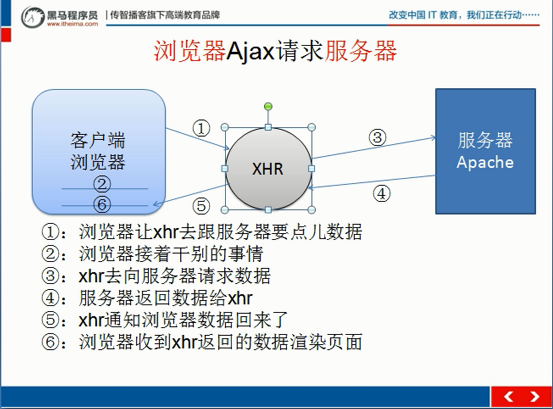
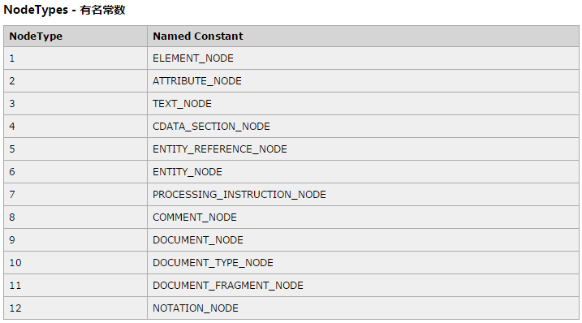

###1. Jquery的ajax返回类型？###
​	**json,html,script,text,xml,jsonp**

###2. 关于域名和IP的理解###

   每一台机都有一个唯一的IP地址，域名相当于是IP地址，当IP地址很难记的时候就会出现域名，通过

   域名服务器来完成域名地址到IP地址转化，域名服务器运行着一个数据库，其中存储着域名和IP，访问百度首页的时候，其实发生了两件事:  **进行域名解析 （DNS）通过解析得到的IP地址找到对应的计算机**

   ####IP与域名的对应关系是：####

   （1）一对一：

   Internet上IP地址是唯一的，一个IP地址对应着唯一的一台主机。

   给定一个域名地址能找到一个唯一对应的IP地址。

   （2）一对多：

   一台计算机提供多个服务，既作www服务器又作邮件服务器。

   IP地址还是唯一，但可根据计算机提供的多个服务给予不同域名。

   一个IP地址可以对应多个域名。

###3. URL地址###

   **URL组成部分：** `<scheme>://<user>:<password>@<host>:<port>/<path>;<params>?<query>#<frag>`

   **scheme	协议方案：**

   ```
   http            #超文本传输协议，我们浏览网站都是用这个
   https           #安全的http链接，在应用层和传输层中间加了SSL层
   mailto          #通过该链接可以在Internet中发送邮件
   ftp             #文件传输协议,传输文件
   rtsp.rtspu      #这个可能看见的少，是因为这是流传输，譬如视频流
   ```

  **user: password：**

   权限访问的时候使用帐号密码，譬如你的网站没配置好权限，有的时候你打开的时候就需要输入帐号密码

   **host：**简单的来说就是IP（域名）或者主机名domain

   **port：**端口，我们访问的端口，譬如 8080等等

   **path：**访问资源的路径，相当于组件路径

   **params：**参数，但是这个不常用，指定一些参数，譬如指定传输方式

   **query：**查询参数，譬如我们get username=widuu&password=11111

   **frag：**html资源片段，譬如html文档过大的时候，frag定位到html的一部分

###4. IPV4和IPV6###
  IPv6是Internet Protocol Version 6的缩写，其中Internet Protocol译为 ”互联网协议“。IPv6是IETF（互联网工程任务组，Internet Engineering Task Force）设计的用于替代现行版本IP协议（IPv4）的下一代IP协议，规范IP的样式 。

  IPv4的地址位数为32位，也就是最多有2的32次方的电脑可以联到Internet上，IPV6是128位的，由于IPv4最大的问题在于网络地址资源有限，严重制约了互联网的应用和发展。

  IPv6的使用，不仅能解决网络地址资源数量的问题，而且也解决了多种接入设备连入互联网的障碍。

  在使用IPv6网络中用户可以对网络层的数据进行加密并对IP报文进行校验,这极大的增强了网络安全.

###5. 静态网站和动态网站的区别 ###

###6. B/S模式和C/S模式:  Browser/Server结构      Client/Server结构

   Client/Server结构：是大家熟知的软件系统体系结构

   ```
   1.C/S模式将应用与服务分离,系统具有稳定性和灵活性
   2.C/S模式配备的是点对点的结构模式,适用于局域网,有可靠的安全性
   3.由于客户端实现与服务器端的直接连接,没有中间环节,因此响应速度快
   4.在C/S模式中,作为客户机的计算机都要安装客户机程序,一旦软件系统升级,每台客户机都要安装客户机程序,系统升级和维护较为复杂
   ```

   Browser/Server结构：是随着Internet技术的兴起,对C/S结构的一种变化或者改进的结构.在这种结构下,用户界面完全通过WWW浏览器实现登陆操作,一部分事务逻辑在前端实现,但是主要事务逻辑在服务器端实现

   ```
   1.每当服务器应用程序升级时，只要在服务器上升级服务应用程序即可，用户计算机上的浏览器软件不需要修改，系统开发和升级维护方便
   2.在B/S模式下，用户通过通用的浏览器进行访问，系统开放性好
   3.由于Web的平台无关性，B/S模式的结构可以任意扩展，可以从包含一台服务器和几个用户的小型系统扩展成为拥有成千上万个用户的大型系统
   4.B/S模式的应用软件都是基于Web浏览器的，而Web浏览器的界面是类似的。对于无用户交换功能的页面。用户接触的界面都是一致的，用户使用方便
   ```

###7. ajax演示图###
ajax异步的JavaScript和XML，通过和服务器进行数据交换来实现在不重复加载页面的情况下，更新局部网页，网页实现异步最早的时候使用iframe进行实现，现在使用ajax

   	 

###8. JS中异步执行例子###
JavaScript中不按照程序中的顺序执行的函数都有定时器，回调函数，以及ajax代码等等。

###9. JSON###
*JSON*(JavaScript Object Notation) 是一种轻量级的数据交换格式。在json字符串中必须使用双引号，另外json字符串与对象之间相互转化的关系：JSON.parse（将json字符串转化成对象）；JSON*.*stringify();

###10. onreadystatechange事件###
onreadystatechange事件：存储函数（或函数名），每当 readyState 属性改变时，就会调用该函数。

readyState：存有 XMLHttpRequest 的状态。从 0 到 4 发生变化。

    - 0: 请求未初始化
    - 1: 服务器连接已建立
    - 2: 请求已接收
    - 3: 请求处理中
    - 4: 请求已完成，且响应已就绪

###11. 节点类型回顾：###  

###12. GET和POST的区别：###

   **get请求 ：向服务器获取数据**

    1. 数据需要追加到URL中发送，也就是说浏览器将各个表单字段元素及其数据按照URL参数的格式附加在请求行中的资源路径后面，例如：
     	xmlHttp.open("get", "Server.aspx?username=" + encodeURIComponent(username)
            + "&age=" + encodeURIComponent(age) + "&random=" + Math.random());
    2. get提交的数据量比较小，往往会存在缓存问题，导致页面不正确，所以"&random=" + Math.random()，是添加的参数,以求每次访问不同的url。
    3.如果需要请求的URL中存在中文，需要用encodeURIComponent进行编码，处理方式：
    	var param=encodeURLComponent(param);
    4.最后发送请求的时候，参数为空： xmlHttp.send(null);
  **post： 向服务器提交数据**


    1.需要将form表单中的值先取出转换成字符串，用&符号连接，（同GET传参数一样），另外参数不在URL中显示；
    	var data = "username=" + encodeURIComponent(username)
            + "&age=" + encodeURIComponent(age);
        xmlHttp.open("post", "Server.aspx", true);
    2.提交数据量较大，不用担心缓存问题；
    3.如果需要请求的URL中存在中文，需要用encodeURIComponent进行编码，处理方式：
    	var param=encodeURLComponent(param);
    4.最后发送请求的时候，一定要带参数： xmlHttp.send(strings),这个strings表示form中需要提交的内容,也就是上边的data;
    5.另外如果使用POST方式请求服务器的时候，为防止出现表单编码错误，一般会设置form表单的编码格式，		xmlHttp.setRequestHeader('Content-Type', 'application/x-www-form-urlencoded')，处理提交的字符串;

###13. 同步和异步的区别：###

   1）同步
        所谓同步，就是在发出一个功能调用时，在没有得到结果之前，该调用就不返回。做完一件事情才能继续做下一件事情。同步运行效率慢，但是可以简化编程的复杂性，提高开发进度。

  2）异步
        异步的概念和同步相对。异步是指进程不需要一直等下去，而是继续执行下面的操作，不管其他进程的状态。当有消息返回时系统会通知进程进行处理，这样可以提高执行的效率。

###14.eval() 函数可计算某个字符串，并执行其中的的 JavaScript 代码。###

​	该方法只接受原始字符串作为参数，如果 string 参数不是原始字符串，那么该方法将不作任何改变地返回。因此请不要为 eval() 函数传递 String 对象来作为参数。

```
<script type="text/javascript">
	eval("x=10;y=20;document.write(x*y)");//输出 2000
	document.write(eval("2+2"));//输出 4
	var x=10
	document.write(eval(x+17));//输出 27
</script>
```

###15.JSONP###
JSONP(JSON with Padding) 是 json 的一种"使用模式"，可以让网页从别的域名（网站）那获取资料，即跨域读取数据。

###16.JSON.parse与JSON.stringify###
**JSON.parse**
    作用:将JavaScript对象表示法的JSON字符串转换为对象(字符串转对象)
    语法:JSON.parse(text [, reviver])
    text 必选。 一个有效的 JSON 字符串。
    reviver 可选。 一个转换结果的函数。 将为对象的每个成员调用此函数。
    返回值:JSON对象 

**JSON.stringify**

    作用:将 JavaScript json对象转换为JavaScript对象表示法的JSON字符串(对象转为字符串)
    语法:JSON.stringify(value [, replacer]   [, space);
    
    value 必选 通常为对象或数组
    replacer 可选转换结果的函数或数组
    space 可选。 添加缩进、空白和换行符来返回值 JSON 文本更便于阅读。
             如果省略 space，返回值文本生成，没有任何额外的空白。
             如果 space 是数字，则返回值具有空白的文本缩进指定数目在每个级别的。 如果 space 大于 10 时，文本缩进 10 个空白。
             如果 space 为非空字符串，如“\t”，返回值文本缩进与字符串的字符在每个级别。
             如果 space 为大于 10 个字符的字符串，使用前 10 个字符。
    返回值:JSON 包含的文本字符串。

###17.CORS通信###

####17.1CORS简介####
CORS是一个W3C标准，全称是"跨域资源共享"（Cross-origin resource sharing）,它允许浏览器向跨源服务器，发出XMLHttpRequest请求，从而克服了AJAX只能同源使用的限制。

####17.2CORS技术兼容性：####
目前所有浏览器都支持该技术，IE浏览器版本不能低于IE10

####17.3CORS通信原理####
整个CORS通信过程，都是**浏览器自动完成**，不需要用户参与。对于开发者来说，CORS通信与同源的AJAX通信没有差别，代码完全一样。浏览器一旦发现AJAX请求跨源，就会自动添加一些附加的头信息，有时还会多出一次附加的请求，但用户不会有感觉。因此，实现CORS通信的关键是服务器。只要服务器实现了CORS接口，就可以跨源通信。

####17.4浏览器将CORS请求分成两类：**简单请求和非简单请求**。####

只要同时满足以下两大条件，就属于简单请求，其余则均属于非简单请求

    a.请求方法是以下三种方法之一：HEAD，GET，POST   
    b.HTTP的头信息不超出以下几种字段：Accept，Accept-Language，Content-Language，Last-Event-ID    
    Content-Type：只限于application/x-www-form-urlencode、multipart/form-data、text/plain

####17.5简单请求的流程和需要注意的知识点####

#####a.对于简单请求，浏览器直接发出CORS请求。具体来说，就是自动在头信息之中，增加一个Origin字段。#####

  `Origin字段用来说明,本次请求来自哪个源（协议 + 域名 + 端口）。服务器根据这个值,决定是否同意这次请求。`

#####b.如果Origin指定的源，不在许可范围内，#####
服务器会返回一个正常的HTTP回应。浏览器发现，这个回应的头信息**没有包含Access-Control-Allow-Origin**等字段，就知道出错了，从而抛出一个错误，被**XMLHttpRequest**的**onerror**回调函数捕获。注意，这种错误无法通过状态码识别，因为HTTP回应的状态码有可能是200。

#####c.如果Origin指定的域名在许可范围内，服务器返回的响应，会多出几个头信息字段。#####

```
Access-Control-Allow-Origin: http://api.bob.com
Access-Control-Allow-Credentials: true
Access-Control-Expose-Headers: FooBar
Content-Type: text/html; charset=utf-8

```

上面的头信息之中，有三个与CORS请求相关的字段，都以Access-Control-开头。         ​     	 
(1)Access-Control-Allow-Origin:该字段是必须的。它的值要么是请求时Origin字段的值，要么是一个*，表示接受任意域名的请求。

(2)Access-Control-Allow-Credentials:   该字段可选。它的值是一个布尔值，表示是否允许发送Cookie。默认情况下，Cookie不包括在CORS请求之中。设为true，即表示服务器明确许可，Cookie可以包含在请求中，一起发给服务器。这个值也只能设为true，如果服务器不要浏览器发送Cookie，删除该字段即可。

(3)Access-Control-Expose-Headers:   该字段可选。CORS请求时，XMLHttpRequest对象的getResponseHeader()方法只能拿到6个基本字段：Cache-Control、Content-Language、Content-Type、Expires、Last-Modified、Pragma。如果想拿到其他字段，就必须在Access-Control-Expose-Headers里面指定。上面的例子指定，getResponseHeader('FooBar')可以返回FooBar字段的值。

#####d.withCredentials 属性#####

d1.CORS请求默认不发送Cookie和HTTP认证信息。如果要把Cookie发到服务器，**一方面要服务器同意，指定Access-Control-Allow-Credential:ture,另一方面开发者必须在AJAX请求中打开withCredentials属性，即设置xhr.withCredentials = true;**

d2.如果**省略withCredentials设置**，有的浏览器还是会一起发送Cookie。这时，可以显式关闭withCredentials，设置xhr.withCredentials = false即可。

d3.需要注意的是**，如果要发送Cookie，**Access-Control-Allow-Origin就不能设为星号**，必须指定明确的、与请求网页一致的域名。同时，Cookie依然遵循同源政策，只有用服务器域名设置的Cookie才会上传，其他域名的Cookie并不会上传，且（跨源）原网页代码中的document.cookie也无法读取服务器域名下的Cookie。

####17.6非简单请求的流程和需要注意的知识点####

#####a.预检请求#####

​非简单请求，比如请求方法是PUT或DELETE，或者Content-Type字段的类型是application/json，非简单请求的CORS请求，会在正式通信之前，增加一次HTTP查询请求，称为"预检"请求（preflight）。

浏览器先询问服务器，当前网页所在的域名是否在服务器的许可名单之中，以及可以使用哪些HTTP动词和头信息字段。只有得到肯定答复，浏览器才会发出正式的**XMLHttpRequest**请求，否则就报错。

如果javascript中使用了非简单请求，那么浏览器会自动发送一个预检请求，要求服务器允许这样的请求，**预检请求头信息**可能包含以下的头信息

```
javascript
OPTIONS /cors HTTP/1.1   //预检请求使用的方法是OPTIONS,表明是来询问的， 
Origin: http://api.bob.com  //关键字段，表示请求来自哪个源 
Access-Control-Request-Method: PUT 
Access-Control-Request-Headers: X-Custom-Header 
Host: api.alice.com Accept-Language: en-US 
Connection: keep-alive 
User-Agent: Mozilla/5.0...

```
  （1）Access-Control-Request-Method 该字段是必须的，用来列出浏览器的CORS请求会用到哪些HTTP方法，上例是PUT。 
  （2）Access-Control-Request-Headers 该字段是一个逗号分隔的字符串（xhr.setRequestHeader('X-Custom-Header', 'value')，指定浏览器CORS请求会额外发送的头信息字段
#####b.预检请求的回应信息：#####

*允许请求*

 ```
javascript
HTTP/1.1 200 OK
Date: Mon, 01 Dec 2008 01:15:39 GMT
Server: Apache/2.0.61 (Unix)
Access-Control-Allow-Origin: http://api.bob.com
Access-Control-Allow-Methods: GET, POST, PUT
Access-Control-Allow-Headers: X-Custom-Header
Content-Type: text/html; charset=utf-8
Content-Encoding: gzip
Content-Length: 0
Keep-Alive: timeout=2, max=100
Connection: Keep-Alive
Content-Type: text/plain

 ```

上面的HTTP回应中，关键的是**Access-Control-Allow-Origin**字段，表示**http://api.bob.com**可以	请求数据。该字段也可以设为星号，表示同意任意跨源请求。

**（1）Access-Control-Allow-Methods**
该字段必需，它的值是逗号分隔的一个字符串，表明服务器支持的所有跨域请求的方法。注意，返回的是所有支持的方法，而不单是浏览器请求的那个方法。这是为了避免多次"预检"请求。

**（2）Access-Control-Allow-Headers**
如果浏览器请求包括Access-Control-Request-Headers字段，则Access-Control-Allow-Headers字段是必需的。它也是一个逗号分隔的字符串，表明服务器支持的所有头信息字段，不限于浏览器在"预检"中请求的字段。

**（3）Access-Control-Allow-Credentials**
该字段与简单请求时的含义相同。

**（4）Access-Control-Max-Age**
该字段可选，用来指定本次预检请求的有效期，单位为秒。上面结果中，有效期是20天（1728000秒），即允许缓存该条回应1728000秒（即20天），在此期间，不用发出另一条预检请求。

*否定请求*

如果浏览器否定了"预检"请求，会返回一个正常的HTTP回应，但是**没有任何CORS相关的头信息字段**。这时，浏览器就会认定，服务器不同意预检请求，因此触发一个错误，**被XMLHttpRequest对象的onerror回调函数捕获**。控制台会打印出如下的报错信息。

```
javascript
Access-Control-Allow-Methods: GET, POST, PUT
Access-Control-Allow-Headers: X-Custom-Header
Access-Control-Allow-Credentials: true
Access-Control-Max-Age: 1728000
```

####17.7CORS和JSONP的优缺点比较####

  a.JSONP只支持GET请求，CORS支持所有类型的HTTP请求     
  b.JSONP的优势在于支持老式浏览器，以及可以向不支持CORS的网站请求数据。      
  c.使用CORS，开发者可以使用普通的XMLHttpRequest发起请求和获得数据，比起JSONP有更好的错误处理。
### 18.跨域请求常用方法###
**JSONP，jQuery中的$.ajax()，CORS，iframe，window.name**


