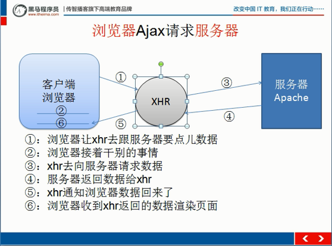
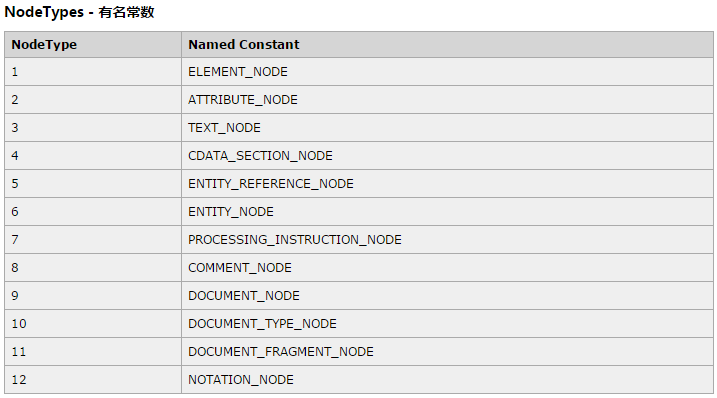

1. Jquery的ajax返回类型？json,html,script,text,xml,jsonp

2. 关于域名和IP的理解

   每一台机都有一个唯一的IP地址，域名相当于是IP地址，当IP地址很难记的时候就会出现域名，通过

   域名服务器来完成域名地址到IP地址转化，域名服务器运行着一个数据库，其中存储着域名和IP，访问百度首页的时候，其实发生了两件事:  **进行域名解析 （DNS）     通过解析得到的IP地址找到对应的计算机**

   IP与域名的对应关系是：

   （1）一对一：

   Internet上IP地址是唯一的，一个IP地址对应着唯一的一台主机。

   给定一个域名地址能找到一个唯一对应的IP地址。

   （2）一对多：

   一台计算机提供多个服务，既作www服务器又作邮件服务器。

   IP地址还是唯一，但可根据计算机提供的多个服务给予不同域名。

   一个IP地址可以对应多个域名。

3. URL地址

   URL组成部分：**<scheme>://<user>:<password>@<host>:<port>/<path>;<params>?<query>#<frag>**

   scheme	协议方案：

   ```
   http            #超文本转移协议，我们浏览网站都是这个
   https           #安全的http连接，在应用层和传输层中间加了SSL层
   mailto          #通过该链接可以在Internet中发送邮件
   ftp             #文件传输协议,传输文件
   rtsp.rtspu      #这个可能看见的少，是因为这是流传输，譬如视频流
   ```

   user: password：

   ```
   权限访问的时候使用帐号密码，譬如你的网站没配置好权限，有的时候你打开的时候就需要输入帐号密码
   ```

   host：简单的来说就是IP（域名）或者主机名domain

   port：端口，我们访问的端口，譬如80 443 8080等等

   path：访问资源的路径，相当于组件路径

   params：参数，但是这个不常用，指定一些参数，譬如指定传输方式

   query：查询参数，譬如我们get username=widuu&password=11111

   frag：html资源片段，譬如html文档过大的时候，frag定位到html的一部分

4. IPv6是Internet Protocol Version 6的缩写，其中Internet Protocol译为 ”互联网协议“。IPv6是IETF（互联网工程任务组，Internet Engineering Task Force）设计的用于替代现行版本IP协议（IPv4）的下一代IP协议，规范IP的样式 。

   由于IPv4最大的问题在于网络地址资源有限，严重制约了互联网的应用和发展。IPv6的使用，不仅能解决网络地址资源数量的问题，而且也解决了多种接入设备连入互联网的障碍。

   IPv4的地址位数为32位，也就是最多有2的32次方的电脑可以联到Internet上，IPV6是128位的，

   在使用IPv6网络中用户可以对网络层的数据进行加密并对IP报文进行校验,这极大的增强了网络安全.

5. 静态网站和动态网站的区别

6. B/S模式和C/S模式:    Browser/Server结构      Client/Server结构

7. ajax异步的JavaScript和XML，通过和服务器进行数据交换来实现在不重复加载页面的情况下，更新局部网页，网页实现异步最早的时候使用iframe进行实现，现在使用ajax

   ​	 

8. JavaScript中不按照程序中的顺序执行的函数都有定时器，回调函数，以及ajax代码等等。

9. *JSON*(JavaScript Object Notation) 是一种轻量级的数据交换格式。在json字符串中必须使用双引号，另外json字符串与数组之间相互转化的关系：JSON.parse（将json字符串转化成数组）；JSON*.*stringify();

10. onreadystatechange：存储函数（或函数名），每当 readyState 属性改变时，就会调用该函数。

   readyState：存有 XMLHttpRequest 的状态。从 0 到 4 发生变化。

- 0: 请求未初始化
- 1: 服务器连接已建立
   - 2: 请求已接收
   - 3: 请求处理中
   - 4: 请求已完成，且响应已就绪

11. **节点类型回顾：**  

21. **GET和POST的区别：**

   get请求的时候url代码里边传中文的话，需要进行编码，处理方式：var param=encodeURLComponent(param);

     参数要用encodeURIComponent进行编码，（URI:是一个用于标识某一互联网资源名称的字符串）

     URL只支持大约2K的长度，即2048字符数；使用GET进行AJAX请求时候会缓存导致出现的页面不是正确的，一般方法加random参数值；ajax.send(null)。

     **POST**

     向服务器提交数据用到。

     需要将form表单中的值先取出转换成字符串，用&符号连接，（同GET传参数一样）；提交数据量2GB ；使用ajax.setRequestHeader('Content-Type', 'application/x-www-form-urlencoded')，处理提交的字符串;ajax.send(strings)，这个strings表示form中需要提交的内容，例如a=1&b=2类似这样的字符串。

     另外如果使用POST方式请求服务器的时候，以防出现表单编码错误，一般会加xhr.setRequestHeader('Content-Type','application/x-www-form-urlencoded')；另外xhr.send();中一定要带参数。

13. 同步和异步的区别：

   1）同步

      所谓同步，就是在发出一个功能调用时，在没有得到结果之前，该调用就不返回。按照这个定义，其实绝大多数函数都是同步调用（例如sin, isdigit等）。但是一般而言，我们在说同步、异步的时候，特指那些需要其他部件协作或者需要一定时间完成的任务。最常见的例子就是 SendMessage。该函数发送一个消息给某个窗口，在对方处理完消息之前，这个函数不返回。当对方处理完毕以后，该函数才把消息处理函数所返回的 LRESULT值返回给调用者。

      2）异步

      异步的概念和同步相对。当一个异步过程调用发出后，调用者不能立刻得到结果。实际处理这个调用的部件在完成后，通过状态、通知和回调来通知调用者。以CAsycSocket类为例（注意，CSocket从CAsyncSocket派生，但是起功能已经由异步转化为同步），当一个客户端通过调用 Connect函数发出一个连接请求后，调用者线程立刻可以朝下运行。当连接真正建立起来以后，socket底层会发送一个消息通知该对象。这里提到执行部件和调用者通过三种途径返回结果：状态、通知和回调。可以使用哪一种依赖于执行部件的实现，除非执行部件提供多种选择，否则不受调用者控制。如果执行部件用状态来通知，那么调用者就需要每隔一定时间检查一次，效率就很低（有些初学多线程编程的人，总喜欢用一个循环去检查某个变量的值，这其实是一种很严重的错误）。如果是使用通知的方式，效率则很高，因为执行部件几乎不需要做额外的操作。至于回调函数，其实和通知没太多区别。

1.  JavaScript 函数 eval() 可用于将 JSON 文本转换为 JavaScript 对象。语法：var obj = eval ("(" + txt + ")");

2.  Jsonp(JSON with Padding) 是 json 的一种"使用模式"，可以让网页从别的域名（网站）那获取资料，即跨域读取数据。

3.  **JSON.parse**

    作用:将JavaScript对象表示法的JSON字符串转换为对象(字符串转对象)
    语法:JSON.parse(text [, reviver])
    text 必选。 一个有效的 JSON 字符串。
    reviver 可选。 一个转换结果的函数。 将为对象的每个成员调用此函数。
    返回值:JSON对象 

    **JSON.stringify**

    作用:将 JavaScript json对象转换为JavaScript对象表示法的JSON字符串(对象转为字符串)
    语法:JSON.stringify(value [, replacer]   [, space);

    value 必选 通常为对象或数组
    replacer 可选转换结果的函数或数组
    space 可选。 添加缩进、空白和换行符来返回值 JSON 文本更便于阅读。
             如果省略 space，返回值文本生成，没有任何额外的空白。
             如果 space 是数字，则返回值具有空白的文本缩进指定数目在每个级别的。 如果 space 大于 10 时，文本缩进 10 个空白。
             如果 space 为非空字符串，如“\t”，返回值文本缩进与字符串的字符在每个级别。
             如果 space 为大于 10 个字符的字符串，使用前 10 个字符。
    返回值:JSON 包含的文本字符串。

    ​


   

   ​

   ​

## you@yourdomain，localhost##


