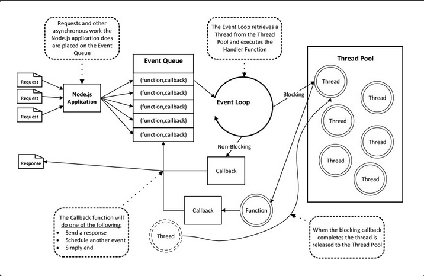

## *Node*.*js*知识点总结##

### 1.安装node的方法以及优缺点###

#### (1). 安装包的方式安装####

+更新版本

- 操作方式：
  - 重新下载最新的安装包；
  - 覆盖安装即可；
- 问题：
  - 以前版本安装的很多全局的工具包需要重新安装
  - 无法回滚到之前的版本
    - 无法在多个版本之间切换（很多时候我们要使用特定版本）		                                     

#### (2). NVM（Node Version Manager）工具的使用####

由于以后的开发工作可能会在多个Node版本中测试，而且Node的版本也比较多，所以需要这么款工具来管理

#### 安装操作步骤

a.下载：[nvm-windows](https://github.com/coreybutler/nvm-windows/releases/download/1.1.0/nvm-noinstall.zip)

b.解压到一个全英文路径

c.编辑解压目录下的`settings.txt`文件（不存在则新建）

- `root 配置为当前 nvm.exe 所在目录`
- `path 配置为 node 快捷方式所在的目录`
  - `arch 配置为当前操作系统的位数（32/64）`
  - `proxy 不用配置`

1. 配置环境变量 可以通过 window+r  : sysdm.cpl

- `NVM_HOME = 当前 nvm.exe 所在目录`
- `NVM_SYMLINK = node 快捷方式所在的目录`
  - `PATH += %NVM_HOME%;%NVM_SYMLINK%;`
  - 打开CMD通过`set [name]`命令查看环境变量是否配置成功
  - PowerShell中是通过`dir env:[name]`命令

1. NVM使用说明：

- https://github.com/coreybutler/nvm-windows/

1. NPM的目录之后使用再配置

### 2.什么是Node？### 

- Node 就是 JavaScript 语言在服务器端的运行环境
- 所谓“运行环境（平台）”有两层意思：
  - 首先，JavaScript 语言通过 Node 在服务器运行，在这个意义上，Node 有点像 JavaScript 虚拟机；
  - 其次，Node 提供大量工具库，使得 JavaScript 语言与操作系统互动（比如读写文件、新建子进程），在这个意义上， Node 又是 JavaScript 的工具库。

### 3.Node.js简介###

**Node.js 是一个基于 [Chrome V8](https://developers.google.com/v8/) 引擎的 JavaScript 运行环境。Node.js 使用了一个事件驱动、非阻塞式 I/O 的模型，使其轻量又高效。Node.js 的包管理器 [npm](https://www.npmjs.com/)，是全球最大的开源库生态系统。**

### 4.为什么要配置环境变量？### 

#### path变量的值是用户变量中的值与系统变量中的值的叠加。#### 

**1）环境变量：** 

环境变量是一个具有特定名字的对象，它包含了一个或者多个应用[程序](http://baike.baidu.com/view/17674.htm)所将使用到的信息。例如path，当要求系统运行一个[程序](http://baike.baidu.com/view/17674.htm)而没有告诉它程序所在的完整路径时，系统除了在[当前目录](http://baike.baidu.com/view/396351.htm)下面寻找此程序外，还应到path中指定的路径去找。用户通过设置环境变量，来更好的运行进程。

**2）windows系统的系统变量和用户变量是什么？** 

**系统环境变量，对所有用户起作用,而用户环境变量只对当前用户起作用。**

例如：你要用java，那么你把java的bin目录加入到path变量下面（添加方法），那么它就是系统环境变量，所有用户登陆，在命令行输入java都会有java的帮助信息出来。而如果你在某个用户的变量下面新建一个变量，那么它就只对这个用户有用，当你以其他用户登陆时这个变量就和不存在一样。

### 5.REPL运行环境### 

**1）** 在Node.js中，提供了一个交互式运行环境——REPL。在这个运行环境中，我们可以做一些简单的应用程序的测试或调试。另外，由于Node.js中内部使用V8 JavaScript脚本引擎来解析并执行V8 JavaScript脚本语言，因此REPL也是一个极好的用于测试我们的JavaScript脚本代码的运行环境。

**2）** 在命令行窗口中，输入“node”命令并按下回车键，即可进入REPL运行环境，命令行窗口中将会显示REPL运行环境中的命令提示符（默认为“>”），在REPL运行环境中，我们可以执行变量的操作、函数的书写及执行等操作。

**3）** 任何时候，当你输入任何表达式并按下回车键后，REPL运行环境中均会显示该表达式的执行结果。在REPL运行环境中，可以使用var关键字来定义一个变量并为其赋值，但是在输入了对其赋值进行的表达式后，该表达式的执行结果将被显示为undefined。将简单类型的值赋值给变量后，输入变量名后按下回车键，REPL运行环境中将直接显示该变量值

**4）** 在REPL运行环境中，可以通过下划线字符（“_”）的使用来访问最近使用的表达式。但是输入下划线并不意味着可以修改变量的值。你也可以通过下划线字符的使用来访问最近一次表达式执行结果的属性或对其执行方法。例如:下划线.length

**5）** **REPL运行环境中的基础命令**

.break：当你在书写一个多行函数的中途想要放弃该函数的书写或重新书写该函数时，该命令可以使你返回到命令提示符的起点处，使你可以重新书写新的表达式或重新书写该函数

可使用按下Ctrl+C组合键的方法来代替.break命令的输入,在REPL运行环境中的命令提示符后按下两次Ctrl+C组合可退出REPL运行环境

.clear：用于清除REPL运行环境的上下文对象中保存的所有变量与函数，除了可以清除上下文对象中保存的所有变量与函数，当你在书写一个多行函数的中途想要放弃该函数的书写或重新书写该函数时，clear命令也可以使你返回到命令提示符的起点处，使你可以重新书写新的表达式或重新书写该函数

.exit：该命令用于退出REPL运行环境

.help：该命令将在命令行窗口中显示REPL运行环境中的所有基础命令

.save：该命令将把你在REPL运行环境中输入的所有表达式保存到一个文件中，使用方法及执行结果

.load：该命令将把某个文件中保存的所有表达式依次加载到REPL运行环境中，使用方法及执行结果

**6）在REPL运行环境中直接运行函数**

可以在REPL运行环境中直接运行某个函数。在REPL运行环境中，可以将一个表达式（如本例中的一个函数）分为多行进行书写，当该表达式未书写完成时，REPL运行环境将为该表达式的每一行（第一行除外）添加英文省略符（三个小圆点）。

在REPL运行环境中，也可以在父函数中嵌套运行子函数，当父函数分为多行进行书写时，REPL运行环境将在子函数体内的每行代码之前继续添加英文省略符（三个小圆点）。

### 6.bom和dom对象？###

### 7.进程和线程### 

进程：电脑上运行的每一个程序都是一个进程，它代表CPU所能处理的单个任务，CPU总是运行一个进程，其他进程处于非运行状态。（针对于单核CPU来说）

线程：用来执行应用程序的代码，每当新开始一个进程的时候，都会自动开启一个线程，而在一个进程中可以有多个线程；在一个线程内部，只做一件事情，当遇到一时执行不完的循环或者程序的时候，会开启另外的线程

**1) 简而言之,一个程序至少有一个进程,一个进程至少有一个线程.**

2) 线程的划分尺度小于进程，使得多线程程序的并发性高。

3) 另外，进程在执行过程中拥有独立的内存单元，而多个线程共享内存，从而极大地提高了程序的运行效率。

4) 线程在执行过程中与进程还是有区别的。每个独立的线程有一个程序运行的入口、顺序执行序列和程序的出口。**但是线程不能够独立执行，**必须依存在应用程序中，由应用程序提供多个线程执行控制。

5) 从逻辑角度来看，多线程的意义在于一个应用程序中，有多个执行部分可以同时执行。但操作系统并没有将多个线程看做多个独立的应用，来实现进程的调度和管理以及资源分配。**这就是进程和线程的重要区别。**

### 8.Linux系统终端常用命令### 

ctrl+l--清屏  

ctrl+c 终止命令  

ctrl+d退出shell,

ctrl+z将当前进程置于后台，fg还原

ctrl+r 从命令历史中找

ctrl+a  光标移到行首

ctrl+e  光标移到行尾

ctrl+u  清除光标到行首的字符

ctrl+w 清除光标之前的一个单词

ctrl+k  清除光标到行尾的字符

 ctrl+t  交换光标前的两个字符

ctrl+y 粘贴前一ctrl+u类命令删除的字符

ctrl+p  上一条命令

ctrl+n  下一条命令

ctrl+f  光标后移一个字符

ctrl+b  光标前移一个字符

ctrl+h  删除光标前的一个字符

ctrl+s  挂起当前shell

ctrl+q重新启动

!!  重新执行上一条命令

!n 重新执行第N条历史命令

!-n:p  打印上一条命令（不执行）

### 9.Node.JS的全局对象### 

global:类似于客户端JavaScript运行环境中的windows

process:用于获取当前的Node进程信息，一般用于获取环境变量之类的信息

console：Node中内置的console模块，提供操作控制台的输入输出功能


### 10.模板字符串（反撇号）### 

  ES6引入了一种新型的字符串字面量语法，我们称之为模板字符串（template strings）。除了使用反撇号字符 ` 代替普通字符串的引号 ' 或 " 外，它们看起来与普通字符串并无二致。在最简单的情况下，它们与普通字符串的表现一致，但是模板字符串为JavaScript提供了简单的**字符串插值** 功能，从此以后，你可以通过一种更加美观、更加方便的方式向字符串中插值了。

   ```
      function authorize(user, action) {
        if (!user.hasPrivilege(action)) {
          throw new Error(
            `用户 ${user.name} 未被授权执行 ${action} 操作。`);
        }
      }
   ```

      在这个示例中，${user.name}和${action}被称为**模板占位符** ，JavaScript将把user.name和action的值插入到最终生成的字符串中。

      **模板字符串中所有的空格、新行、缩进，都会原样输出在生成的字符串中。** 

      **同时模板字符串有些需要注意的细节：** 

-    模板占位符中的代码可以是任意JavaScript表达式，所以函数调用、算数运算等这些都可以作为占位符使用，你甚至可以在一个模板字符串中嵌套另一个，我称之为模板套构（template inception）。

-    如果这两个值都不是字符串，可以按照常规将其转换为字符串。例如：如果action是一个对象，将会调用它的.toString()方法将其转换为字符串值。

     - 如果你需要在模板字符串中书写反撇号，你必须使用反斜杠将其转义：`\``等价于"`"。

     - 同样地，如果你需要在模板字符串中引入字符$和{。无论你要实现什么样的目标，你都需要用反斜杠转义每一个字符：`\$`和`\{`。

       **标签字符串** 

###  11. 代码中清空控制台的方法### 

  – process.stdout.getWindowSize();

  或者

  – process.stdout.write('\033[2J');
  – process.stdout.write('\033[0f');

###  12.Node.JS异步操作### 

• Node 采用 Chrome V8 引擎处理 JavaScript 脚本，V8 最大特点就是单线程运行，一次只能运行一个任务。
• Node 大量采用异步操作（asynchronousoperation），即任务不是马上执行，而是插在任务队列的尾部，等到前面的任务运行完后再执行。
• 优点：提高代码的响应能力。

###  13.Node.js中回调函数的设计### 

  对于一个函数如果需要定义回调函数，**那么一般回调函数都作为最后一个参数出现** 

  • function foo1(name, age, callback) { }
  • function foo2(value, callback1, callback2) { }

  回调函数的第一个参数默认接收错误信息，第二个参数才是真正的回调数据（便于外界获取调用的错误情况）：

  ​	 foo1('赵小黑', 19, function(error, data) {
  ​	       if(error) throw error;
  ​	            console.log(data);
  ​         });

  **一般回调函数遵循错误优先原则：**

  ​	因为之后的操作大多数都是异步的方式，无法通过 trycatch 捕获异常，所以错误优先的回调函数
  ​	的 第一个参数为上一步的错误信息

###  14.console.time### 

   在Node.js中，当需要统计一段代码的执行时间时，可以使用console.time方法与console.timeEnd方法，其中console.time方法用于标记开始时间，console.timeEnd方法用于标记结束时间，并且将结束时间与开始时间之间经过的毫秒数在控制台中输出。

   这两个方法均使用一个参数，参数值可以为任何字符串，但是这两个方法所使用的参数字符串必须相同，才能正确地统计出开始时间与结束时间之间所经过的毫秒数。

### 15.Node.js的事件驱动###

​	Node的事件驱动模型，事件驱动的实质就是**主循环线程+事件触发***的方式来运行程序,事件驱动搞懂这张图

 


​	与Nginx的服务原理类似，Node采用事件驱动的运行方式。不过nginx式多进程单线程，而Node通过事件驱动的方式处理请求时无需为每一个请求创建额外的线程。在事件驱动的模型当中，每一个IO工作被添加到事件队列中，线程循环地处理队列上的工作任务，当执行过程中遇到堵塞(读取文件、查询数据库)时，线程不会停下来等待结果，而是留下一个处理结果的**回调函数** ，转而继续执行队列中的下一个任务。这个传递到队列中的回调函数在堵塞任务运行结束后才被线程调用。

​	前面也说过Node Async IO = CPS + Callback，这一套实现开始于Node开始启动的进程，在这个进程中Node会创建一个循环，每次循环运行就是一个Tick周期，每个Tick周期中会从事件队列查看是否有事件需要处理，如果有就取出事件并执行相关的回调函数。事件队列事件全部执行完毕，node应用就会终止。Node对于堵塞IO的处理在幕后使用线程池来确保工作的执行。Node从池中取得一个线程来执行复杂任务，而不占用主循环线程。这样就防止堵塞IO占用空闲资源。当堵塞任务执行完毕通过添加到事件队列中的回调函数来处理接下来的工作。

### 16.文件的相关操作### 

详情了解简书文章：http://www.jianshu.com/p/5683c8a93511

**return一般都是在函数内部** 

### 17.Javascript模块的规范### 

通行的Javascript模块规范共有两种：CMD，[CommonJS](http://wiki.commonjs.org/wiki/Modules/1.1)和[AMD](https://github.com/amdjs/amdjs-api/wiki/AMD)

### 18.eval()函数：###

​	eval() 函数可计算某个字符串，并执行其中的的 JavaScript 代码。

​	语法：eval(string)，string：必需。要计算的字符串，其中含有要计算的 JavaScript 表达式或要执行的语句。

​	eg:    eval("2+2")，eval(x+17)，eval("alert('Hello world')")

### 19.process.argv的三个参数###

​	argv[0]:当前node进程执行的绝对路径

​	argv[1]：正在被执行的JavaScript路径

​	argv[2]:命令行参数，一般都是命令行输入的参数

```
process.argv.slice(2);//获取process.argv参数中下标为2的参数，并且将这个参数分割为数组
```

### 20.CommonJS 模块###

​	**1.模块的定义** 

​		1） 一个新的 JS 文件就是一个模块；

​		2） 一个合格的模块应该是有导出成员的，否则模块就失去了定义的价值；

​		3）模块内部是一个独立（封闭）的作用域（模块与模块之间不会冲突）；

​		4） 模块之间必须通过导出或导入的方式协同；

​		5）导出方式： exports.name = value;  module.exports = { name: value };

​		6）exports 是指向 module.exports 的别名，相当于在模块开始的时候执行：– var exports =  		module.exports;一旦为 module.exports 赋值，就会切断之前两者的相关性；

​	**2.CommonJs模块的特点**    

​		1）所有代码都运行在模块作用域，不会污染全局作用域。
​		2）模块可以多次加载，但是只会在第一次加载时运行一次，
​		   然后运行结果就被缓存了，以后再加载，就直接读取缓存结果。要想让模块再次运行，必须清除缓存。
​		3）模块加载的顺序，按照其在代码中出现的顺序。

​	**3.模块的分类** 

​		***1） 文件模块*** 
​		– 就是我们自己写的功能模块文件
​		***2） 核心模块*** 
​		– Node 平台自带的一套基本的功能模块，也有人称之为 Node平台的 API（**fs和path** ）

​		path模块：

​			a)规范化路径：正斜线/，反斜线\，路径中上一级..和.的规范，发现多个斜线的被替换成一个

​			b)拼合路径：path.join('/f', 'e', 'd/c', '..');   // 输出  /f/e/d  **通过拼合路径获得绝对路径** 

​			c)返回一个路径的目录名称：path.dirname('/f/e/d');     // 输出 /f/e  

​			d) 返回一个路径中最低一级目录名称：path.basename('/f/e/d');     //  输出 d  

​			e) 返回一个路径的文件扩展名：路径最低一级目录中'.'字符后的任何字符串，如何没有'.'或者只	有'.'，返回空字符串：

​			path.extname('/f/e/d.html');     //输出  .html  

​			path.extname('/f/e/d/.');           //输出  ''

​		***3）第三方模块***
​		– 社区或第三方个人开发好的功能模块，可以直接拿回来用

​	**4.模块的开发流程** 

​		创建模块（new calc.js）>导出成员（module.exports = {}）>载入模板（var calc = require('./calc.js')）	>使用模块（calc.add(1, 2)）

​	**5.模块中的全局环境** 

​		1）我们在以后的文件操作中必须使用绝对路径
​		2） __dirname：用于获取当前文件所在目录的完整路径；但是 在 REPL 环境无效；
​		3） __filename： 用来获取当前文件的完整路径；但是 在 REPL 环境同样无效；

​		4）module： 模块对象

​			a).Node 内部提供一个 Module 构建函数。所有模块都是Module 的实例，属性如下：

​				• module.id 模块的识别符，通常是带有绝对路径的模块文件名。
​				•  module.filename 模块定义的文件的绝对路径。
​				•  module.loaded 返回一个布尔值，表示模块是否已经完成加载。
​				•  module.parent 返回一个对象，表示调用该模块的模块。
​				•  module.children 返回一个数组，表示该模块要用到的其他模块。
​				• module.exports 表示模块对外输出的值。

​			b).载入一个模块就是构建一个 Module 实例

​		5） exports： 映射到 module.exports 的别名
​		6）require()：
​			– require.cache
​			– require.extensions
​			– require.main
​			– require.resolve()

### 21.require模块###  

​	 1.Node 使用 CommonJS 模块规范，内置的 require 函数用于加载模块文件。

​	 2.require 的基本功能是，读入并执行一个 JavaScript 文件，然后返回该模块的 exports 对象。

​	 3.如果没有发现指定模块，会报错。

​	 4.require 加载文件时可以省略扩展名：

​		– require('./module'); // 此时文件按 JS 文件执行
​		– require('./module.js'); // 此时文件按 JSON 文件解析
​		– require('./module.json'); // 此时文件预编译好的 C++ 模块执行
​		– require('./module.node');

​	 5.require的加载文件的规则：

​		1）通过 ./ 或 ../ 开头：则按照相对路径从当前文件所在文件夹开始寻找模块；

​			– require('../file.js'); => 上级目录下找 file.js 文件

​		2）通过 / 开头：则以系统根目录开始寻找模块（以绝对路径的方式找）；

​			– require('/Users/iceStone/Documents/file.js');

​		3）如果参数字符串不以“./“ 或 ”/“ 开头，则表示加载的是一个默认提供的核心模块（位于 Node 的系统安
​		装目录中）：

​			– require('fs'); => 加载核心模块中的文件系统模块

​		4） 或者从当前目录向上搜索 node_modules 目录中的文件：

​			– require('my_module'); => 各级 node_modules 文件夹中搜索 my_module.js 文件；

​		5）如果 require 传入的是一个目录的路径，会自动查看该目录的 package.json 文件，然后加载 main 		字段指定的入口文件；如果package.json文件没有main字段，或者根本就没有package.json文件，则默认找目录下的 index.js 文件作为模块：

​	6.模块的缓存

​		1） 第一次加载某个模块时，Node 会缓存该模块。以后再加载该模块，就直接从缓存取出该模块的
​		 module.exports 属性（不会再次执行该模块）

​		2） 如果需要多次执行模块中的代码，一般可以让模块暴露行为（函数）

​		3） 模块的缓存可以通过 require.cache 拿到，同样也可以删除

​	7.require的实现机制

​		1） 将传入的模块 ID 通过加载规则找到对应的模块文件

​		2） 读取这个文件里面的代码

​		3）通过拼接的方式为该段代码构建私有空间

​		4）执行该代码

​		5）拿到 module.exports 返回

### 22.Node.Js的核心模块###

1. Node内置了一些功能模块，用于与操作系统互动 。 

2. Node内常用的内置模块有： 

   path：处理文件路径。

   fs：操作（CRUD）文件系统。

   child_process：新建子进程。

   util：提供一系列实用小工具。

   http：提供 HTTP 服务器功能。

   url：用于解析 URL。

   querystring：解析 URL 中的查询字符串。

   crypto：提供加密和解密功能。

   Node.Js网址：[https://nodejs.org/api](https://nodejs.org/api/)[/](https://nodejs.org/api/) 

### 23.包的概念和包管理工具###

1. 什么是包？ 

   由于Node是一套轻内核的平台，虽然提供了一系列的内置模块，但是不足以满足开发者的需求，于是乎出现了包（package）的概念：

   ​	**与核心模块类似，就是将一些预先设计好的功能或者说API 封装到一个文件夹，提供给开发者使用；** 	

   ​	**模块和包没有本质的区别，包是实现某一个功能模块的集合，通常用于发布和维护。** 

2. 包的加载机制：(遵循require的加载机制)

   包名的情况：require('http')，–先在系统核心（优先级最高）的模块中找；–然后再到当前项目中 node_modules 目录中找；**以后不要创建一些和现有的包重名的包；** 

3. NPM(Node Package Manager):

   对NPM的两层概念的理解：

   1)一层含义是 Node 的开放式模块登记和管理系统，亦可以说是一个生态圈，一个社区

   2)另一层含义是 Node 默认的模块管理器，是一个命令行下的软件，用来安装和管理 Node 模块。

4. NPM安装

   1）NPM 不需要单独安装。默认在安装 Node 的时候，会连带一起安装 NPM。

   2）但是，Node 附带的 NPM 可能不是最新版本，最好用下面的命令，更新到最新版本。

   ​	**$ npm install npm -g** 

   ​	默认安装到当前系统Node 所在目录下。

   3）配置NPM的全局目录

   ​	$ npm config set prefix [pathtonpm]

   ​	将 NPM 目录配置到其他目录时，必须将该目录放到环境变量中，否则无法再全局使用

5. 常用的NPM的命令

   •npm config

   •npm init

   •npm search

   •npm info

   •npm install

   •npm uninstall

   •npm list

   •npm outdated

   •npm update

   •npm run

   •npm cache [clean|ls]

### 24.Buffer缓冲区###

	#### 1.对于Buffer的介绍####

​	所谓缓冲区Buffer，就是 "临时存贮区" 的意思，是暂时存放输入输出数据的一段内存。

​	1）JavaScript 语言自身只有字符串数据类型，没有二进制数据类型。但在处理像TCP流或文件流时，必须使用到二进制数据。**因此在 Node.js中，定义了一个 Buffer 类，该类用来创建一个专门存放二进制数据的缓存区。** 

​	2）在 Node.js 中，Buffer 类是随 Node 内核一起发布的**核心库** 。**Buffer 库为 Node.js 带来了一种存储原始数据的方法，可以让 Node.js 处理二进制数据** ，每当需要在 Node.js 中处理I/O操作中移动的数据时，就有可能使用 Buffer 库。原始数据存储在 Buffer 类的实例中。一个 Buffer 类似于一个整数数组，但它对应于 V8 堆内存之外的一块原始内存。

#### 2.缓冲区的一些相关操作####

​	**1）创建缓冲区（Buffer类）** 

​		a.以字节数创建：var buf = new Buffer(10);

​		b.通过给定的数组创建：var buf = new Buffer([10, 20, 30, 40, 50]);

​		c.通过一个字符串创建：var buf = new Buffer("www.runoob.com", "utf-8");

​	**2）写入缓冲区**

​		a. 

​			参数描述如下：

​			**string** - 写入缓冲区的字符串。

​			**offset** - 缓冲区开始写入的索引值，默认为 0 。

​			**length** - 写入的字节数，默认为 buffer.length

​			**encoding** - 使用的编码。默认为 'utf8' 。

​			返回值：写入的字节数，如果 buffer 空间不足， 则只会写入部分字符串。

​	**3）从缓冲区读取数据**

​		语法：buf.toString([encoding[, start[, end]]])

​		参数描述如下：

​		**encoding** - 使用的编码。默认为 'utf8' 。

​		**start** - 指定开始读取的索引位置，默认为 0。

​		**end** - 结束位置，默认为缓冲区的末尾。

​		返回值：解码缓冲区数据并使用指定的编码返回字符串。

​	**4）将 Buffer 转换为 JSON 对象** 

​		语法：将 Node Buffer 转换为 JSON 对象的函数语法格式如下：buf.toJSON()；

​		返回值：返回 JSON 对象。

​	**5）缓冲区合并** 

​		Node 缓冲区合并的语法如下所示：Buffer.concat(list[, totalLength])；

​		参数：

​		**list** - 用于合并的 Buffer 对象数组列表。

​		**totalLength** - 指定合并后Buffer对象的总长度。

​		返回值：返回一个多个成员合并的新 Buffer 对象。

​	**6）缓冲区的比较**

​		语法：buf.compare(otherBuffer);

​		返回值：返回一个数字，表示 **buf** 在 **otherBuffer** 之前，之后或相同。

​	**7）拷贝缓冲区**

​		语法：buf.copy(targetBuffer[, targetStart[, sourceStart[, sourceEnd]]])

​		参数：

​		**targetBuffer** - 要拷贝的 Buffer 对象。

​		**targetStart** - 数字, 可选, 默认: 0

​		**sourceStart** - 数字, 可选, 默认: 0

​		**sourceEnd** - 数字, 可选, 默认: buffer.length

​		返回值：没有返回值

​		实例：

​		var buffer1 = new Buffer('ABC');// 拷贝一个缓冲区

​		var buffer2 = new Buffer(3);

​		buffer1.copy(buffer2);

​	**8）缓冲区裁剪**

​		语法：buf.slice([start[, end]])；

​		参数：

​		**start** - 数字, 可选, 默认: 0

​		**end** - 数字, 可选, 默认: buffer.length

​		返回值：返回一个新的缓冲区，它和旧缓冲区指向同一块内存，但是从索引 start 到 end 的位置剪切。

​	**9）缓冲区的长度**

​		语法：buf.length;

​		返回值：返回 Buffer 对象所占据的内存长度。

http://www.runoob.com/nodejs/nodejs-buffer.html  Buffer的详尽的API介绍

### 25.base64编码和dataURI协议###

	####     1.base64编码：####

​	**base64编码的应用场景：** 

​	**1）所有的二进制文件，都可以因此转化为可打印的文本编码，使用文本软件进行编辑；** 

​	我们知道在计算机中任何数据都是按ASCII码存储的，而ascii码的128～255之间的值是不可见字符，

​	而在网络上交换数据时，比如说从A地传到B地，往往要经过多个路由设备，由于不同的设备对字符的处理方			式有一些不同，这样那些不可见字符就有可能被处理错误，这是不利于传输的。所以就先把数据先做一个Base64编码，统统变成可见字符，这样出错的可能性就大降低了。

​	**2）能够对文本进行简单的加密。** 

​	对证书来说，特别是根证书，一般都是作Base64编码的，因为它要在网上被许多人下载。电子邮件的附件一		般也作Base64编码的，因为一个附件数据往往是有不可见字符的。

​	**base64编码的转换方式：** 

​	**1）Base64的编码转换方式。**

​	所谓Base64，就是说选出64个字符----小写字母a-z、大写字母A-Z、数字0-9、符号"+"、"/"（再加上作为垫字       的"="，实际上是65个字符）----作为一个基本字符集。然后，其他所有符号都转换成这个字符集中的字符。

​	具体来说转换步骤有4步：

​	第一步，将每三个字节作为一组，一共是24个二进制位。

​	第二步，将这24个二进制位分为四组，每个组有6个二进制位。

​	第三步，在每组前面加两个00，扩展成32个二进制位，即四个字节。

​	第四步，根据下表，得到扩展后的每个字节的对应符号，这就是Base64的编码值。

​	**2）如果字节数不足三，则这样处理：** 

```
a）二个字节的情况：将这二个字节的一共16个二进制位，按照上面的规则，转成三组，最后一组除了前面加两个0以外，后面也要加两个0。这样得到一个三位的Base64编码，再在末尾补上一个"="号。
比如，"Ma"这个字符串是两个字节，可以转化成三组00010011、00010110、00010000以后，对应Base64值分别为T、W、E，再补上一个"="号，因此"Ma"的Base64编码就是TWE=。
```

```
b）一个字节的情况：将这一个字节的8个二进制位，按照上面的规则转成二组，最后一组除了前面加二个0以外，后面再加4个0。这样得到一个二位的Base64编码，再在末尾补上两个"="号。
比如，"M"这个字母是一个字节，可以转化为二组00010011、00010000，对应的Base64值分别为T、Q，再补上二个"="号，因此"M"的Base64编码就是TQ==。
```

	#### 2.dataURI协议（uniform resource   identifier统一资源标识符）####

​	格式：

```
data:[<MIME type>][;charset=<charset>][;base64],<encoded data>
```

其实整体可以视为三部分，即声明：参数+数据，逗号左边的是各种参数，右边的是数据。

**声明：**data:是URI的协议头，表明其资源是一个data URI；

1. MIME type，表示数据呈现的格式，即指定嵌入数据的[MIME](http://zh.wikipedia.org/wiki/MIME)。对于PNG的图片，其格式是：image/png，如果没有指定，默认是：text/plain；
2. character set(字符集）大多数被忽略，默认是：charset=US-ASCII。如果指定是的数据格式是图片时，字符集将不再使用；
3. base64，这一部分将表明其数据的编码方式，此处为声明后面的数据的编码是[base64](http://zh.wikipedia.org/wiki/Base64)，我们可以不必使用base64编码格式，如果那样，我们将使用标准的URL编码方式（形如%XX%XX%XX的格式）；

**数据：**这个encoded data部分为实际的数据，可能包含空格，但是无关紧要。

### 26.iconv-lite库###

​	linux环境下，我们可以通过 [iconv](https://github.com/bnoordhuis/node-iconv) 这个C++模块来处理Node.JS不支持的字符编码，如GBK，BIG5。

### 27.文件读取###

​	1）异步文件读取

​		–fs.readFile(file[,options],callback(err,data))

​	2）同步文件读取

​		–fs.readFileSync(file,[,option])

​	3）文件流的方式读取（后面单独介绍）

​		–fs.createReadStream(path[, options])

### 28.逐行读取文本

```
const readline = require('readline');
const fs = require('fs');
 
const rl = readline.createInterface({
  input: fs.createReadStream('sample.txt')
});
 
rl.on('line', (line) => {
  console.log('Line from file:', line);
});
```

案例：歌词的滚动操作？？

### 29.文件写入

​	1）异步文件写入（覆盖文件原来的内容，不会创建文件，没有找到目录会报错）

​		––fs.writeFile(file,data[,option],callback(err))；

​	2）同步文件写入（覆盖文件原来的内容，不会创建文件，没有找到目录会报错）

​		––fs.writeFileSync(file,data,[,option])；

​	3）流式文件写入（后边将详细了解）

​		––fs.createWriteStream(path[,option])；

​	4）异步追加（在文件原来的内容的基础上追加，不会创建文件，没有找到目录会报错）

​	      –fs.appendFile(file,data[,options],callback(err))

​	5同步追加（在文件原来的内容的基础上追加，不会创建文件，没有找到目录会报错）

​		–fs.appendFileSync(file,data[,options])

#### 默认写入操作是覆盖源文件，确保操作没有额外的问题，一定使用绝对路径的方式####

### 30.监视文件变化###

	#### 1.相关操作####

​	1）fs.watchFile(filename[,options], listener(curr,prev))

​		options:{persistent,interval}

​	2）fs.watch(filename[,options][,listener])

#### 2.坚实文件的案例####

​	利用文件监视实现自动 markdown 文件转换

​	相关资料的网址：•https://https://github.com/chjj/marked

​				       •https://github.com/Browsersync/browser-sync

实现案例？？？

### 31.文件的其他相关操作###

#### 1）验证路径是否存在####

​	–fs.exists(path,callback(exists))

​	–fs.existsSync(path) // => 返回布尔类型 exists

#### 2）获取文件的信息####

​	–fs.stat(path,callback(err,stats))

​	–fs.statSync(path) // => 返回一个fs.Stats实例

#### 3）移动文件####


​	–fs.rename(oldPath,newPath)

#### 4）重命名文件或目录####

​	–fs.rename(oldPath,newPath,callback)

​	–fs.renameSync(oldPath,newPath)

#### 5）删除文件####

​	–fs.unlink(path,callback(err))

​	–fs.unlinkSync(path)

### 32.objReg.exec(string) 正则表达式的exec(string)方法：###

该函数通过对指定你的字符串进行一次匹配检测，获取字符串中的第一个与正则表达式的内容，并且将匹配的内容和子匹配的结果存放在返回数组中 

### 33.流的概念###

#### 1.Stream是一个抽象接口，Node中很多对象都实现了这个接口。在node中有4种流类型####

​	**Readable** - 可读操作。

​	**Writable** - 可写操作。

​	**Duplex** - 可读可写操作.

​	**Transform** - 操作被写入数据，然后读出结果。

​	所有的 Stream 对象都是 EventEmitter 的实例。

​	**data** - 当有数据可读时触发。

​	**end** - 没有更多的数据可读时触发。

​	**error** - 在接收和写入过程中发生错误时触发。

​	**finish** - 所有数据已被写入到底层系统时触发。

#### 2.常用的流操作####

​	**1）从流中读取数据**	

```
var fs = require("fs");
var data = '';//定义一个装数据的变量
// 创建可读流，读取input.txt文件
var readerStream = fs.createReadStream('input.txt');
// 设置编码为 utf8。
readerStream.setEncoding('UTF8');
// 处理流事件 --> data, end, and error
readerStream.on('data', function(chunk) {
   data += chunk;
});
readerStream.on('end',function(){
   console.log(data);
});
readerStream.on('error', function(err){
   console.log(err.stack);
});
console.log("程序执行完毕");
```

**2.写入流**

```
var fs = require("fs");
var data = '菜鸟教程官网地址：www.runoob.com';
// 创建一个可以写入的流，写入到文件 output.txt 中
var writerStream = fs.createWriteStream('output.txt');
// 使用 utf8 编码写入数据
writerStream.write(data,'UTF8');
// 标记文件末尾
writerStream.end();
// 处理流事件 --> data, end, and error
writerStream.on('finish', function() {
    console.log("写入完成。");
});
writerStream.on('error', function(err){
   console.log(err.stack);
});
console.log("程序执行完毕");
```

**3.pipe管道流**

​	管道提供了一个输出流到输入流的机制。通常我们用于从一个流中获取数据并将数据传递到另外一个流中，实现大文件的复制过程

```
var fs = require("fs");
// 创建一个可读流
var readerStream = fs.createReadStream('input.txt');
// 创建一个可写流
var writerStream = fs.createWriteStream('output.txt');
// 管道读写操作
// 读取 input.txt 文件内容，并将内容写入到 output.txt 文件中
readerStream.pipe(writerStream);
console.log("程序执行完毕");
```

### 34.Socket（双向通信）###

网络上的两个程序通过一个双向的通信连接实现数据的交换，这个连接的一端称为一个socket。

Socket的英文原义是“孔”或“插座”，通常也称作"[套接字](http://baike.baidu.com/view/538713.htm)"，用于描述IP地址和端口，可以用来实现不同虚拟机或不同计算机之间的通信。

socket是一种"打开—读/写—关闭"模式的实现，服务器和客户端各自维护一个"文件"，在建立连接打开后，可以向自己文件写入内容供对方读取或者读取对方内容，通讯结束时关闭文件。

socket在客户端和服务端之间通信，大致的过程如下：

 

* 服务器根据地址类型（ipv4,ipv6）、socket类型、协议创建socket

* 服务器为socket绑定ip地址和端口号

* 服务器socket监听端口号请求，随时准备接收客户端发来的连接，这时候服务器的socket并没有被打开

* 客户端创建socket

* 客户端打开socket，根据服务器ip地址和端口号试图连接服务器socket

* 服务器socket接收到客户端socket请求，被动打开，开始接收客户端请求，直到客户端返回连接信息。这时候socket进入**阻塞**状态，所谓阻塞即accept()方法一直到客户端返回连接信息后才返回，开始接收下一个客户端谅解请求

* 客户端连接成功，向服务器发送连接状态信息

* 服务器accept方法返回，连接成功

* 客户端向socket写入信息

* 服务器读取信息

* 客户端关闭

* 服务器端关闭

  参考博客：http://www.cnblogs.com/dolphinX/p/3460545.html


### 35.本地回环地址###

​	本地回环地址，不属于任何一个有类别地址类。**它代表设备的本地虚拟接口** ，所以默认被看作是永远不会宕掉的接口。在windows操作系统中也有相似的定义，所以通常在不安装网卡前就可以ping通这个本地回环地址。一般都会用来检查本地[网络协议](http://baike.baidu.com/view/16603.htm)、基本数据接口等是否正常的。

​	本地回环地址的作用：

​	1.一是测试本机的网络配置，能PING通[127.0.0.1](http://baike.baidu.com/view/971216.htm)说明本机的网卡和IP协议安装都没有问题

​	2.另一个作用是某些SERVER/CLIENT的应用程序在运行时需调用服务器上的资源，一般要指定SERVER的IP地址，但当该程序要在同一台机器上运行而没有别的SERVER时就可以把SERVER的资源装在本机，SERVER的IP地址设为127.0.0.1同样也可以运行。

### 36.net模块	###

​	Net 模块提供了一些用于底层的网络通信的小工具，包含了创建服务器/客户端的方法，我们可以通过以下方式引入该模块

```
var net = require("net");
```

	#### 1.net模块的一些方法：####

​	1).**net.createServer([options][, connectionListener])**

​	创建一个 TCP 服务器。参数 connectionListener 自动给 'connection' 事件创建监听器。

​	2).**net.connect(options[, connectionListener])**

​	返回一个新的 'net.Socket'，并连接到指定的地址和端口。当 socket 建立的时候，将会触发 'connect' 事件。

​	3).**net.createConnection(options[, connectionListener])**

​	创建一个到端口 port 和 主机 host的 TCP 连接。 host 默认为 'localhost'。

​	4).**net.connect(port[, host][, connectListener])**

​	创建一个端口为 port 和主机为 host的 TCP 连接 。host 默认为 'localhost'。参数 connectListener 将会作为		 监听器添加到 'connect' 事件。返回 'net.Socket'。

​	5).**net.createConnection(port[, host][, connectListener])**

​	创)建一个端口为 port 和主机为 host的 TCP 连接 。host 默认为 'localhost'。参数 connectListener 将会作为监听器添加到 'connect' 事件。返回 'net.Socket'。

​	6).**net.connect(path[, connectListener])**

​	创建连接到 path 的 unix socket 。参数 connectListener 将会作为监听器添加到 'connect' 事件上。返回 'net.Socket'。

​	7).**net.createConnection(path[, connectListener])**

​	创建连接到 path 的 unix socket 。参数 connectListener 将会作为监听器添加到 'connect' 事件。返回 'net.Socket'。

​	8).**net.isIP(input)**

​	检测输入的是否为 IP 地址。 IPV4 返回 4， IPV6 返回 6，其他情况返回 0。

​	9).**net.isIPv4(input)**

​	如果输入的地址为 IPV4， 返回 true，否则返回 false。

​	10).**net.isIPv6(input)**

​	如果输入的地址为 IPV6， 返回 true，否则返回 false。

#### 2.net.Server：	####

​	**net.Server通常用于创建一个 TCP 或本地服务器。常用的方法如下：**

​	1).**server.address()**

​	操作系统返回绑定的地址，协议族名和服务器端口。

​	2).**server.listen(port[, host][, backlog][, callback])**

​	监听指定端口 port 和 主机 host ac连接。 默认情况下 host 接受任何 IPv4 地址(INADDR_ANY)的直接连接。	端口 port 为 0 时，则会分配一个随机端口。

​	3).**server.close([callback])**

​	服务器停止接收新的连接，保持现有连接。这是异步函数，当所有连接结束的时候服务器会关闭，并会触发 'close' 事件。

​	4).**server.listen(options[, callback])**

​	options 的属性：端口 port, 主机 host, 和 backlog, 以及可选参数 callback 函数, 他们在一起调用	server.listen(port, [host], [backlog], [callback])。还有，参数 path 可以用来指定 UNIX socket。

#### 3.net.Socket常用方法####

​	net.Socket 对象是 TCP 或 UNIX Socket 的抽象。net.Socket 实例实现了一个双工流接口。 他们可以在用户创建客户端(使用 connect())时使用, 或者由 Node 创建它们，并通过 connection 服务器事件传递给用户。

​	1）.**new net.Socket([options])：**构造一个新的 socket 对象。

​	2）**socket.connect(port[, host][, connectListener])**
​	指定端口 port 和 主机 host，创建 socket 连接 。参数 host 默认为 localhost。通常情况不需要使用 net.createConnection 打开 socket。只有你实现了自己的 socket 时才会用到。

​	3）**socket.setEncoding([encoding])：**设置编码

​	4）**socket.write(data[, encoding][, callback])**
​	在 socket 上发送数据。第二个参数指定了字符串的编码，默认是 UTF8 编码。

​	5）**socket.address()**
​	操作系统返回绑定的地址，协议族名和服务器端口。返回的对象有 3 个属性，比如{ port: 12346, family: 'IPv4', address: '127.0.0.1' }。

### 37.util核心模块###

**util 是一个Node.js 核心模块，提供常用函数的集合，用于弥补核心JavaScript 的功能 过于精简的不足。** 

​	1.**util.inherits**  

​	util.inherits(constructor, superConstructor)是一个实现对象间原型继承 的函数。JavaScript 的面向对象特性是基于原型的，与常见的基于类的不同。JavaScript 没有 提供对象继承的语言级别特性，而是通过原型复制来实现的。

​	2.**util.inspect** 	

​	util.inspect(object,[showHidden],[depth],[colors])是一个将任意对象转换 为字符串的方法，通常用于调试和错误输出。它至少接受一个参数 object，即要转换的对象。

​	3.**util.isArray(object)**:如果给定的参数 "object" 是一个数组返回true，否则返回false。

​	4**.util.isRegExp(object):**如果给定的参数 "object" 是一个正则表达式返回true，否则返回false。

​	5.**util.isDate(object)**:如果给定的参数 "object" 是一个日期返回true，否则返回false。

​	6.**util.isError(object)**:如果给定的参数 "object" 是一个错误对象返回true，否则返回false。


telnet客户端？？http基础？？
模仿老师的代码写一个命令行的窗口？？

今天将菜鸟教程的node.js课程结束？？


node.js.orgnode官网

www.npmjs.org npm官网

github官网

stackoverflow.com

