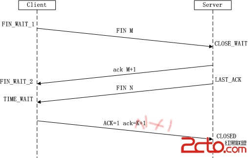

## TCP/IP协议

### 1.TCP/IP协议（协议集

传输控制协议/因特网互联协议，又名网络通讯协议，是Internet最基本的协议，由网络层的IP协议和传输层的TCP协议组成， 它规范了网络上所有的通信设备，尤其是一个主机到另一个主机之间的数据往来格式和传送方式。

TCP/IP协议的四层：

OSI参考模型：开放式通信系统互联参考模型，是一个试图使各种计算机在世界范围内互连为网络的标准框架

- **1.1 TCP/IP协议参考模型：**

> **应用层:**向用户提供一组常用的应用程序，比如电子邮件、文件传输访问，远程登陆等；应用层包含了所有的高层协议，如FTP、TELNET、DNS、SMTP、RIP、NFS、HTTP。
>
> **传输层（TCP/UDP）**：提供应用程序之间通信，传输协议的选择根据数据传输方式而定，有传输控制协议TCP和用户数据报协议UDP
>
> **网络层(IP协议、ARP协议等)**：提供不同主机之间的通信，主要是1、处理来自传输层的分组发送请求2、处理输入数据包3、处理路径、流控、拥塞等问题
>
> **数据链路层**：负责数据帧的发送和接收，帧是独立的网络信息传输单元。网络接口层将帧放在网上，或从网上把帧取下来

- **1.2 TCP协议：是一种面向连接的、可靠的、基于字节流的传输层协议**

 所谓的字节流服务（Byte Stream Service）是指为了方便传输，将大块数据分割成以报文段（segment）为单位的数据包进行管理。而可靠的传输服务是指，能够把数据准确可靠地传给对方。一言以蔽之，TCP 协议为了更容易传送大数据才把数据分割，而且 TCP 协议能够确认数据最终是否送达到对方。

- **1.3 TCP和UDP的区别**

TCP（Transmission Control Protocol，传输控制协议）是基于连接的协议，也就是说，在正式收发数据前，必须和对方建立可靠的连接。一个TCP连接必须要经过三次“对话”才能建立起来

UDP（User Data Protocol，用户数据报协议）是与TCP相对应的协议。它是面向非连接的协议，它不与对方建立连接，而是直接就把数据包发送过去！ UDP适用于一次只传送少量数据、对可靠性要求不高的应用环境。

### 2.TCP协议的三次握手和四次挥手

#### 三次握手（建立连接的时候）

- **2.1首先介绍一下数据传输包中的标志位和序号，理解这些字段才能真正的理解三次握手**

（1）序号：Seq序号，占32位，用来标识从TCP源端向目的端发送的字节流，发起方发送数据时对此进行标记。
（2）确认序号：Ack序号，占32位，只有ACK标志位为1时，确认序号字段才有效，Ack=Seq+1。
（3）标志位：共6个，即URG、ACK、PSH、RST、SYN、FIN等，具体含义如下：

```
（A）URG：紧急
（B）ACK：确认
（C）PSH：传送
（D）RST：重置连接。
（E）SYN：发起一个新连接。
（F）FIN：释放一个连接。
```

- **2.2 三次握手具体的过程**

（1）第一次握手：Client将标志位SYN置为1，随机产生一个值seq=J，并将该数据包发送给Server，Client进入SYN_SENT状态，等待Server确认。

（2）第二次握手：Server收到数据包后由标志位SYN=1知道Client请求建立连接，Server将标志位SYN和ACK都置为1，ack=J+1，随机产生一个值seq=K，并将该数据包发送给Client以确认连接请求，Server进入SYN_RCVD状态。

（3）第三次握手：Client收到确认后，检查ack是否为J+1，ACK是否为1，如果正确则将标志位ACK置为1，ack=K+1，并将该数据包发送给Server，Server检查ack是否为K+1，ACK是否为1，如果正确则连接建立成功，Client和Server进入ESTABLISHED状态，完成三次握手，随后Client与Server之间可以开始传输数据了

- **2.3整个过程是由客户端客户端执行connect()时。将触发三次握手。**


#### 四次挥手（释放连接的时候）

  由于TCP连接时全双工的，因此，每个方向都必须要单独进行关闭，这一原则是当一方完成数据发送任务后，发送一个FIN来终止这一方向的连接，收到一个FIN只是意味着这一方向上没有数据流动了，即不会再收到数据了，但是在这个TCP连接上仍然能够发送数据，直到这一方向也发送了FIN。首先进行关闭的一方将执行主动关闭，而另一方则执行被动关闭
 （1）第一次挥手：Client发送一个FIN，用来关闭Client到Server的数据传送（让Server关闭连接），Client进入FIN_WAIT_1状态。[**服务器读通道关闭**]

  （2）第二次挥手：Server收到FIN后，发送一个ACK给Client，确认序号为收到序号+1（与SYN相同，一个FIN占用一个序号），Server进入CLOSE_WAIT状态（Server准备好关闭了）。[**客户机写通道关闭**]

 （3）第三次挥手：Server发送一个FIN，用来关闭Server到Client的数据传送（告诉Client也要关闭连接），Server进入LAST_ACK状态。[**客户机读通道关闭**]

  （4）第四次挥手：Client收到FIN后，Client进入TIME_WAIT状态（关闭了连接），接着发送一个ACK给Server，确认序号为收到序号+1，Server进入CLOSED状态（Server见Client关闭了连接，它也就关了），完成四次挥手。

[**服务器写通道关闭**]

**注意：整个过程是任何一方执行close()操作即可产生挥手操作。** 

